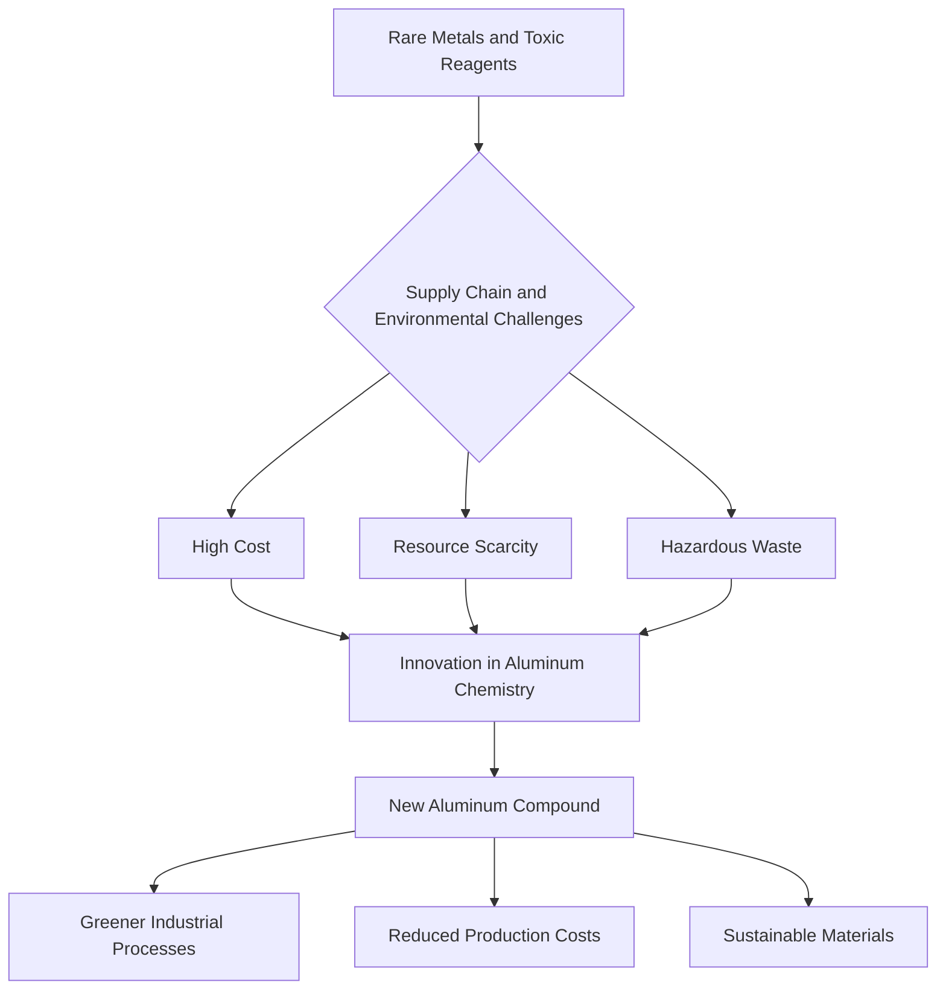

## Aluminum's Ascendance: A Game Changer for Sustainable Chemistry

May 03, 2026

This week, the world of chemistry is buzzing with innovations signaling a decisive shift towards sustainability and efficiency. From breakthroughs in materials science to advanced drug discovery methods, the industry is actively embracing greener alternatives and smarter processes. A standout development, poised to redefine industrial chemistry, comes from King's College London, where scientists have unveiled a novel aluminum compound with the potential to replace expensive and scarce rare metals.

Published on May 1, 2026, the King's College London team's discovery introduces a powerful new aluminum compound featuring a unique triangular structure. This innovative compound exhibits remarkable stability and reactivity, enabling it to drive chemical reactions in ways previously attributed to costly rare earth metals. This breakthrough isn't just an academic feat; it offers a pathway to significantly greener and more affordable industrial processes, potentially leading to the creation of entirely new materials. The implications are vast, suggesting a future where abundant aluminum, approximately 20,000 times less expensive than precious metals like platinum and palladium, could become a workhorse in chemical synthesis and catalysis.

This aligns perfectly with the broader industry momentum towards sustainable chemistry. The International Sustainable Chemistry Collaborative Centre (ISC3) recently launched its Innovation Challenge 2026, focusing on "Sustainable Chemistry and Electronics," with applications closing on May 4, 2026. This initiative seeks groundbreaking ideas for eco-design, resource efficiency, sustainable manufacturing, and circularity within the electronics sector. Similarly, a new report, "Green Chemistry in America 2026," underscores the growing confidence from both industry leaders and consumers that green chemistry drives innovation and economic growth beyond environmental benefits. These efforts, alongside the new aluminum compound, highlight a clear trend: chemistry is rapidly evolving to leverage Earth's most common elements for high-performance, sustainable solutions across industries.

The transformation exemplified by the aluminum discovery illustrates a fundamental shift in chemical methodology:

