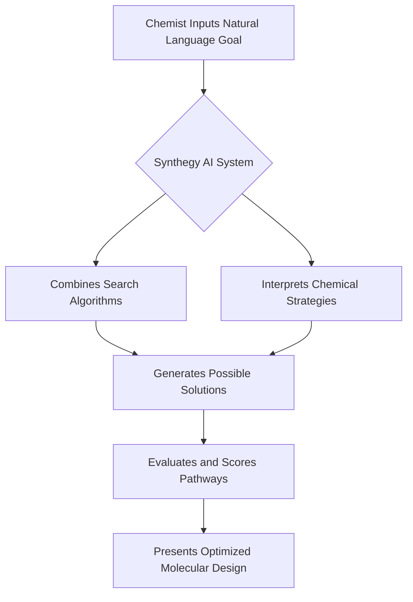

## AI Unlocks Intuitive Molecule Design with "Synthegy" System

**May 7, 2026** – A groundbreaking development in computational chemistry is set to transform how new molecules are conceived, with the unveiling of "Synthegy," an AI system that allows chemists to design complex molecules using natural language. This innovative approach, reported on May 5, 2026, promises to dramatically accelerate discovery in fields ranging from pharmaceuticals to advanced materials.

Traditionally, the creation of new molecules demands years of expertise and countless strategic decisions, particularly in complex processes like retrosynthesis, where chemists work backward from a target molecule to simpler starting materials. While computational tools have long aided in scanning vast "chemical spaces," they often fall short in matching the intuitive strategic judgment of human chemists.

Synthegy bridges this gap by integrating traditional search algorithms with AI that can interpret chemical strategies written in plain language. This means chemists can describe their desired goals and receive evaluated solutions that align with their strategic thinking, moving beyond cumbersome filters and rules of previous tools. The system doesn't merely compute; it reasons, scoring potential pathways and explaining their rationale.

The implications of Synthegy are far-reaching. It is expected to significantly speed up drug discovery, improve the efficiency and design of chemical reactions, and make advanced chemical synthesis tools more accessible to a broader range of scientists. This marks a pivotal shift in how AI supports chemistry, acting as an intelligent guide rather than simply a processing engine.

This advancement comes amidst a broader trend of AI revolutionizing the chemical industry, with machine learning compressing materials discovery timelines from decades to months and generative AI redesigning molecules and optimizing formulas. Such innovations are not only enhancing R&D efficiency but also contributing to the development of sustainable chemistry solutions and the discovery of novel materials.

The intuitive interaction offered by Synthegy represents a significant leap forward, empowering chemists to iterate faster and navigate more intricate synthetic ideas, ultimately accelerating the pace of innovation in chemistry.

