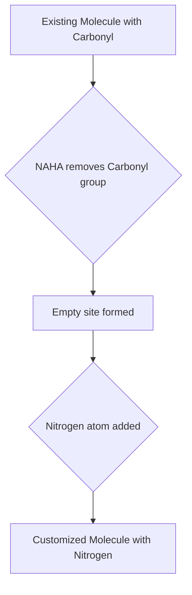

## Accelerating Drug Discovery: A New Chapter in Molecular Customization

**Chicago, IL – May 8, 2026** – The world of chemistry is buzzing with a significant breakthrough from the University of Chicago that promises to dramatically speed up the process of drug discovery. Chemists have unveiled an innovative method to effortlessly swap nitrogen atoms into complex molecules, a development poised to revolutionize how new pharmaceuticals are developed.

One of the most challenging aspects of creating new small-molecule drugs, the category that includes common medications like ibuprofen and treatments for cancer, is the laborious process of synthesizing and customizing molecules. Minor alterations, such as the placement of a single nitrogen atom, can be critical for a drug's effectiveness and its ability to interact with target proteins in the body. Previously, introducing nitrogen where needed could require up to ten complex steps.

The UChicago team has simplified this intricate process, reducing it to as few as one or two steps. Their new technique allows researchers to easily replace a carbonyl group (a carbon-oxygen pair, common in many small molecules) with a nitrogen atom. This is achieved using a specific ingredient called NAHA, which efficiently cleaves the carbonyl bond, making way for nitrogen to be integrated into the molecule.

This "dream reaction," as described by the researchers, offers a simpler, more effective, and inexpensive method for molecular customization. The compatibility of this technique with various functional groups further enhances its utility, presenting chemists with a powerful new tool. The findings, published recently in *Science*, are expected to significantly accelerate the exploration of new drug candidates, enabling scientists to more quickly test different molecular versions to find the most effective treatments.

The ability to "assemble a molecule as a wish" is becoming increasingly tangible, bringing closer a future where drug development is not only faster but also more accessible.

