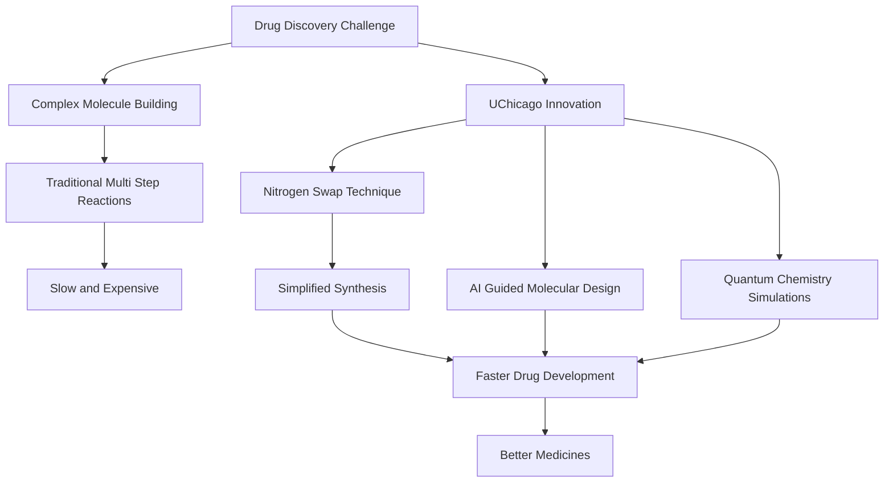

## Chemistry's Cutting Edge: A New Era for Molecular Design Unlocks Faster Drug Discovery

**May 10, 2026** – The world of chemistry is buzzing with rapid advancements, pushing the boundaries of what's possible in molecular creation and drug development. As of this week, two particularly exciting breakthroughs are reshaping how chemists approach complex synthesis, promising to accelerate the path to new medicines and materials.

**Nitrogen Takes Center Stage in Molecular Customization**

A significant stride was announced just days ago, on May 8, 2026, by chemists at the University of Chicago. They have developed a groundbreaking, simpler method to customize molecules by directly swapping carbon-oxygen pairs (carbonyl groups) for nitrogen atoms. This elegant technique, using an ingredient called NAHA, can reduce processes that traditionally required up to ten steps down to just one or two.

The ability to easily integrate nitrogen, a crucial element in many pharmaceuticals, into molecular structures is a "dream reaction" for synthetic chemists. This newfound efficiency is expected to significantly accelerate the discovery process for new small-molecule drugs, which are the basis for countless treatments from ibuprofen to cancer therapies. By making molecule assembly as easy as "imagining a molecule and then making it," researchers can more quickly test compounds, bringing potential new therapies to patients faster.

**Accelerating Innovation with AI and Quantum Computing**

This breakthrough arrives amidst a broader trend of accelerated molecular design, fueled by advanced computational tools. Just a few days prior, on May 6, 2026, news emerged of a new AI system named Synthegy, which empowers chemists to design molecules by simply describing them using natural language. This AI acts as a guide, interpreting strategies and refining computational results, making complex reaction planning more accessible and rapid.

Parallel to this, on May 5, 2026, researchers from Cleveland Clinic, RIKEN, and IBM achieved a monumental feat in computational chemistry. They successfully used quantum-centric supercomputing to simulate protein-ligand complexes of up to 12,635 atoms, a scale previously unattainable with quantum hardware. This dramatic increase in simulation capability provides unprecedented accuracy for predicting how potential drugs interact with biological targets, laying foundational work for "better lifesaving drugs, faster".

These simultaneous advancements in synthetic methodology, artificial intelligence, and quantum computing signify a transformative period in chemistry. The collective impact promises a future where molecular discovery is not only faster and more efficient but also more precise, ultimately leading to significant societal benefits.

