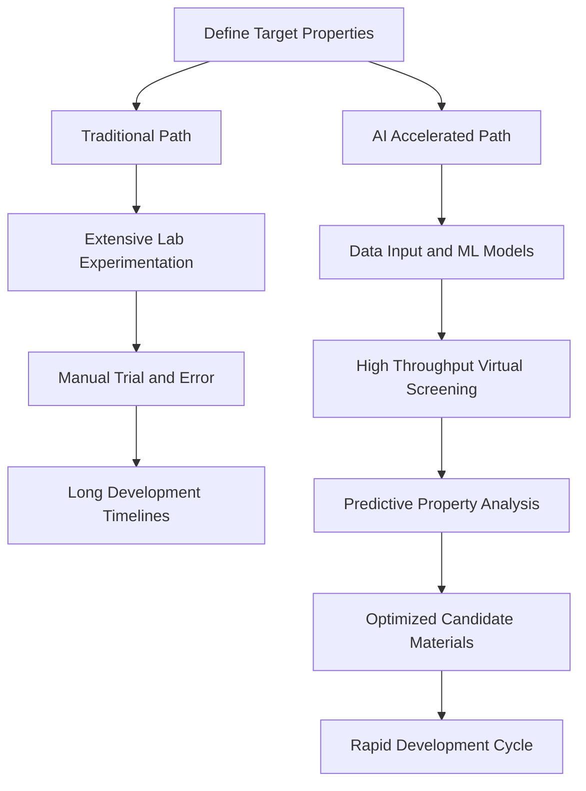

## Chemistry Accelerates into the Future: AI Revolutionizes Materials Discovery

**May 17, 2026** – The world of chemistry is buzzing with innovation, and as of mid-2026, a standout trend is the transformative impact of Artificial Intelligence (AI) and machine learning on materials discovery. This cutting-edge integration is dramatically compressing development timelines, shifting from decades to mere months for identifying and optimizing novel materials.

Traditionally, creating new materials has been a laborious process, relying heavily on iterative laboratory synthesis and extensive characterization—a journey that could span ten to twenty years from initial hypothesis to a commercially viable product. However, AI is fundamentally reshaping this landscape. Researchers are now leveraging machine learning models, including graph neural networks, generative models, and Bayesian optimizers, to computationally screen millions of candidate structures. This allows for the prediction of material properties and the proposal of optimal synthesis conditions *before* a single gram of material is even synthesized in the lab.

This paradigm shift is particularly crucial for sustainable energy technologies, where the demand for advanced batteries, catalysts, and photovoltaics is ever-growing. By applying AI, scientists can systematically explore vast chemical and structural spaces, generating novel materials that are both chemically feasible and functionally optimized. The convergence of large materials databases, advances in deep learning, and increased computational power has made AI-assisted discovery a standard practice in leading research institutions and industrial R&D labs. This acceleration is vital for addressing global challenges, enabling faster development of solutions for energy storage, conversion, and environmental sustainability.

In related news demonstrating the rapid pace of discovery, just this month, MIT chemists announced the successful isolation of a new type of peroxide containing boron, known as a dioxaborirane. Previously considered too unstable to isolate, this molecule forms instantly at room temperature and could expand boron-based chemistry, offering new tools for oxidation reactions and potentially for carbon dioxide capture. Such fundamental breakthroughs, alongside the broad sweep of AI-driven innovation, paint a vibrant picture of chemistry's future.

Here's a simplified look at how AI is speeding up materials discovery:

As we move forward, the integration of AI is not merely a predictive tool but an autonomous research partner, establishing a closed-loop discovery pipeline that promises to transform materials research from a sequential process into a continuous optimization cycle. The future of chemistry, driven by these intelligent systems, is set for unprecedented advancements.