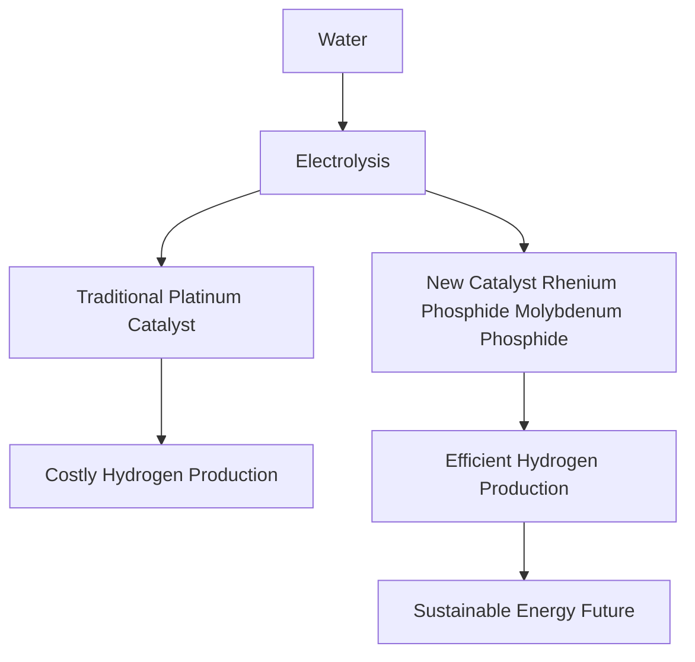

## Chemistry in the News: Powering Tomorrow with Platinum-Free Hydrogen

As of May 18, 2026, the world of chemistry continues its rapid evolution, bringing forth innovations that promise to reshape our future. From sustainable energy solutions to novel molecular discoveries and environmental insights, chemists are at the forefront of tackling global challenges.

One of the most significant breakthroughs making headlines today comes from Washington University in St. Louis, where researchers have unveiled a durable, **platinum-free catalyst for producing clean hydrogen fuel**. This is a monumental step toward making renewable hydrogen cheaper, more efficient, and scalable for real-world energy applications. Traditional hydrogen production often relies on costly platinum group metals, which can be a significant barrier to widespread adoption of hydrogen as a clean energy carrier.

The team, led by Professor Gang Wu, developed a new catalyst specifically designed for an anion-exchange membrane water electrolyzer (AEMWE). This innovative catalyst combines rhenium phosphide (Re2P) and molybdenum phosphide (MoP), creating a highly effective composite. The rhenium component facilitates hydrogen attachment and release, while molybdenum accelerates water splitting in the alkaline electrolyte. This discovery not only reduces reliance on expensive materials but also enhances the overall efficiency of the hydrogen extraction process, promising a more sustainable path to energy storage and industrial feedstocks.

In other recent developments, MIT chemists have successfully discovered and isolated a brand-new boron-oxygen molecule called **dioxaborirane**, a type of peroxide that forms instantly at room temperature. This molecule, once thought too unstable to isolate, opens new avenues for oxidation reactions and potentially for capturing and transforming carbon dioxide. Meanwhile, scientists at Utrecht University have uncovered surprisingly abundant airborne **methylsiloxane pollutants** across various environments, largely stemming from vehicle emissions. These silicone-based compounds, found in urban, rural, and even forest settings, are present at higher levels than expected, raising new questions about their potential health and climate impacts.

These advancements underscore the dynamic and crucial role chemistry plays in addressing critical global issues, from energy security and climate change to fundamental molecular understanding and environmental health.

