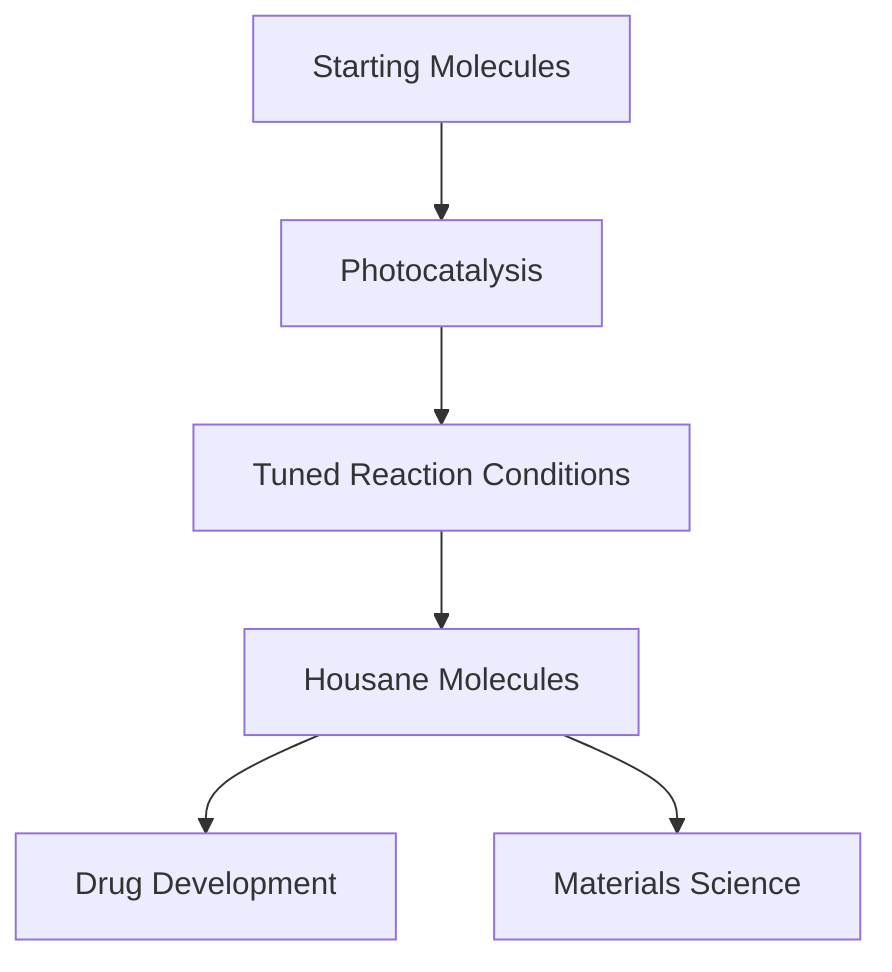

## Light-Powered Chemistry Unlocks New Path for Drug Discovery

**May 20, 2026** – Today marks a bright new chapter in synthetic chemistry, as scientists unveil a groundbreaking light-driven method for creating complex "housane" molecules. This innovative approach promises to accelerate the development of next-generation drugs and advanced materials, tackling a long-standing challenge in molecular synthesis.

Housane molecules, characterized by their compact, high-energy, and ring-shaped structures, are incredibly valuable in medicinal chemistry and materials science. However, their inherent internal strain has made them notoriously difficult to produce efficiently. Traditional synthesis often involves harsh conditions and complex procedures.

Researchers have now developed a method that harnesses light-powered chemistry, specifically photocatalysis, to overcome these hurdles. By carefully tuning the starting molecules and reaction conditions, the team successfully guided the chemical reaction into a clean and efficient pathway, enabling the creation of these previously elusive structures. This breakthrough offers a more accessible and efficient route to housanes, expanding the toolkit available to chemists for building diverse and complex molecular architectures.

The implications of this discovery are far-reaching. For pharmaceutical manufacturing, it could pave the way for novel drug candidates with enhanced properties, potentially leading to new treatments for various diseases. In materials science, the ability to produce these high-tension molecules more readily opens doors for designing advanced materials with unique characteristics. This work represents a significant step forward, highlighting how innovative chemical methods can drive progress in both fundamental research and practical applications.

