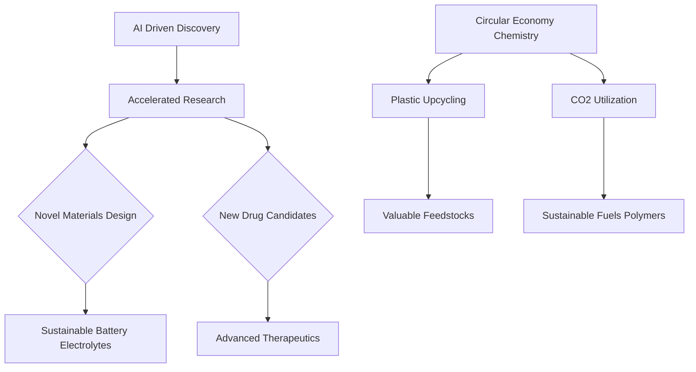

**Chemistry in Focus: May 2026 Innovations Shaping Our World**

As we navigate through May 2026, the world of chemistry continues to deliver groundbreaking advancements, particularly in the twin pillars of artificial intelligence integration and sustainable materials. These innovations are not just theoretical; they are actively transitioning from lab benches to real-world applications, promising transformative impacts on industry and the environment.

A significant theme dominating current discussions is the accelerated pace of **AI-driven materials discovery and drug development**. Researchers are reporting increasingly sophisticated algorithms capable of predicting properties of novel compounds with unprecedented accuracy, drastically cutting down traditional experimental timelines. This has led to the rapid identification of potential new drug candidates for challenging diseases and the design of advanced materials with tailored functionalities. For instance, recent reports highlight successes in using AI to design electrolytes for next-generation solid-state batteries, promising enhanced energy density and safety for electric vehicles and grid storage.

Simultaneously, the quest for a more sustainable future is being bolstered by breakthroughs in **circular economy chemistry**. News this month includes promising developments in plastic upcycling, with new catalytic processes demonstrating the ability to efficiently convert mixed plastic waste streams into valuable chemical feedstocks. These advanced depolymerization and conversion technologies are moving beyond single-plastic types, tackling the complex challenge of heterogeneous waste with increased economic viability. Additionally, advancements in CO2 utilization continue to show potential, with novel catalysts enabling more efficient conversion of industrial carbon emissions into useful products like fuels and polymers, offering a tangible pathway to carbon neutrality. These developments underscore chemistry's pivotal role in addressing global environmental challenges.

