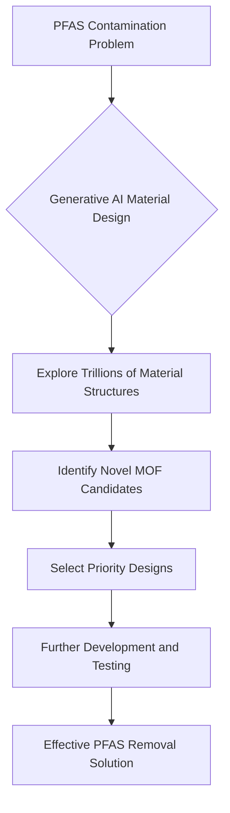

## AI Fights "Forever Chemicals": A Breakthrough in Water Purification

**May 23, 2026** – In a significant leap forward for environmental chemistry, a groundbreaking collaboration between Kemira and CuspAI has led to the development of novel AI-designed materials capable of targeting and removing PFAS, commonly known as "forever chemicals," from drinking and process water. This industry-first breakthrough, announced on May 21, 2026, demonstrates the immense potential of generative artificial intelligence in addressing some of the planet's most persistent pollution challenges.

Per- and polyfluoroalkyl substances (PFAS) are a group of persistent synthetic chemicals that pose severe environmental and health risks due to their stability and widespread presence in water sources globally. Traditional methods of removal have proven challenging, often struggling with trace concentrations.

This new project leveraged generative AI to explore an astonishing design space of approximately 300 trillion possible material structures. Through this expedited process, which compressed years of traditional discovery into just six months, over 5,000 novel material designs were identified with full property data for key PFAS molecules like GenX, PFBS, and PFOS. From these, a refined selection of around 20 priority candidates is now advancing to further development and testing.

The materials designed are a class of nano-porous crystalline materials known as Metal-Organic Frameworks (MOFs), whose structure and chemistry can be precisely tuned for specific filtration and adsorption applications. This pioneering approach by Kemira and CuspAI marks the first commercial partnership to apply generative AI end-to-end for designing entirely new structures from scratch against industrial performance criteria.

This advancement offers a credible path toward a next-generation PFAS remediation product, promising more stable, sustainable, and manufacturable solutions to safeguard our water supplies.

