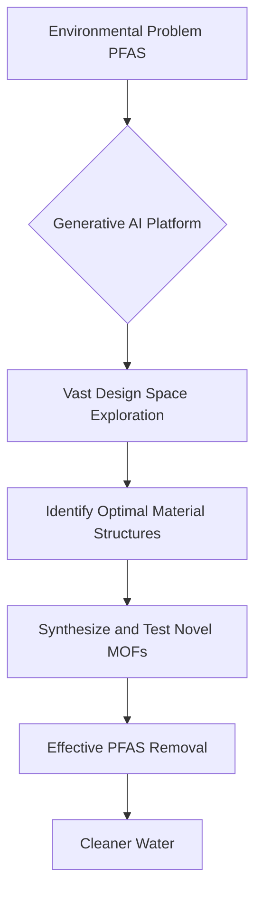

## Chemistry's Cutting Edge: AI Tackles "Forever Chemicals" and Advanced Materials Emerge

As of May 25, 2026, the world of chemistry is buzzing with innovations, particularly at the intersection of artificial intelligence and sustainable solutions. Recent breakthroughs highlight the field's rapid advancement in tackling critical environmental challenges and developing high-performance materials.

One of the most significant pieces of news comes from a collaboration between Kemira and CuspAI, who have leveraged generative artificial intelligence to design novel materials capable of removing "forever chemicals," or PFAS, from drinking and process water. Announced on May 21, 2026, this industry-first partnership has dramatically accelerated the discovery process, compressing years of traditional research into just six months. The AI platform explored trillions of possible material structures, identifying thousands of promising metal-organic frameworks (MOFs) specifically tuned for PFAS remediation. This breakthrough is now moving into the next phase of development and testing, offering a sustainable path toward cleaner water.

In related news, researchers have made strides in fine-tuning a futuristic type of porous glass, also based on metal-organic frameworks, to effectively trap gases like CO2 and hydrogen. Unveiled on May 22, 2026, this innovation draws inspiration from centuries-old glassmaking techniques by incorporating sodium and lithium compounds. These additives make the MOF glass easier to process and shape, accelerating the development of high-performance materials vital for clean energy, advanced manufacturing, and enhanced gas storage. This development underscores the versatility and increasing importance of MOFs, a class of materials that received Nobel recognition in 2025.

These advancements underscore a broader trend: the increasing integration of AI in chemical discovery. From accelerating drug development to designing new catalysts, AI is becoming an indispensable tool, enabling scientists to explore vast chemical spaces and predict material properties with unprecedented speed and accuracy.

Here's a simplified look at how AI is revolutionizing material design for environmental solutions:

