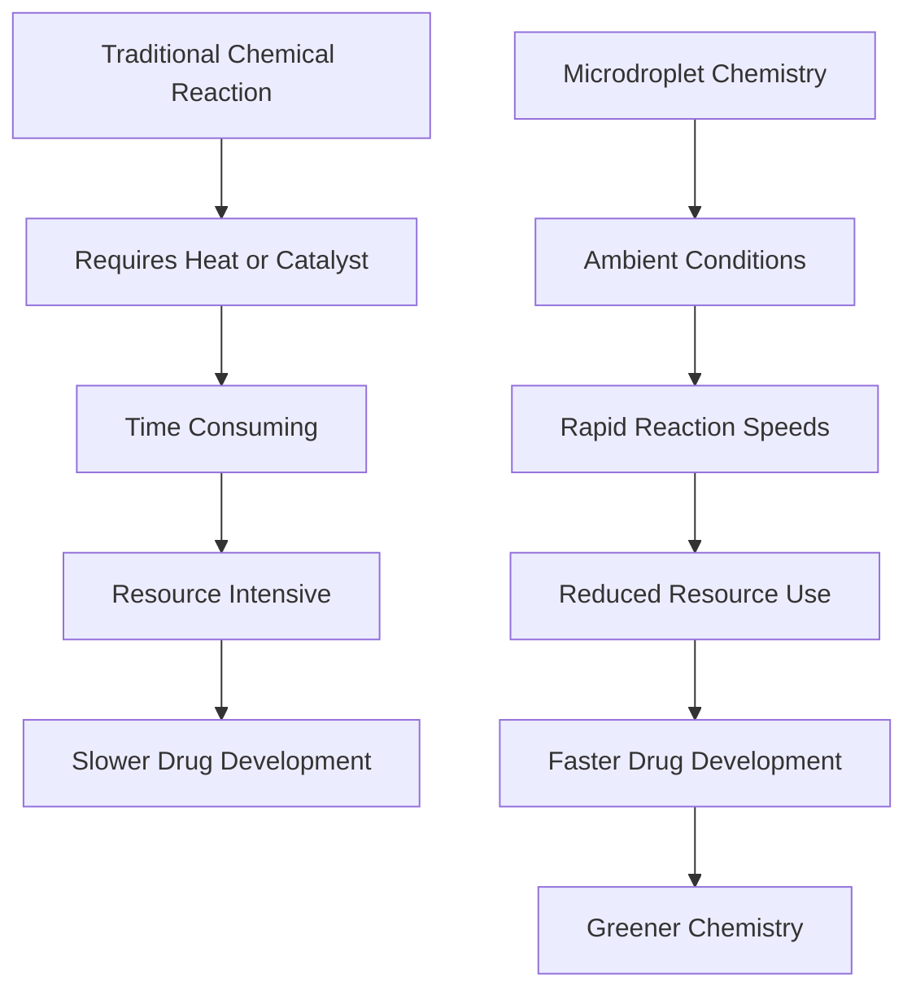

### Chemistry's New Speed Limit: Microdroplets Accelerate Reactions at Ambient Conditions

**June 01, 2026**

In a significant leap for chemical synthesis, researchers at Purdue University have unveiled a groundbreaking method that dramatically accelerates chemical reactions using tiny, fast-moving droplets. This innovation promises to reshape drug discovery and various chemical manufacturing processes by eliminating the need for harsh conditions or expensive catalysts.

Traditional chemical reactions, often the bottleneck in developing new medicines, typically require considerable time, high temperatures, or specialized catalysts to proceed efficiently. These demanding conditions can limit the speed and scalability of producing vital compounds. The Purdue team, led by researcher Graham Cooks and his Aston Labs, has circumvented these long-standing challenges by leveraging the unique environment within microdroplets.

Their method utilizes an advanced automated, high-throughput desorption electrospray ionization (DESI) mass spectrometry system. This innovative setup allows for the same chemical transformations to occur under ambient conditions, without the addition of external heat or catalysts. Essentially, the microdroplets act as miniature reaction vessels, fostering an environment where molecules interact and react at unprecedented speeds. This not only reduces resource consumption but also opens doors for working with sensitive materials that might degrade under conventional methods.

The implications of this breakthrough are vast. By significantly accelerating the chemical synthesis to biological testing cycle, it addresses a crucial translational gap in preclinical drug development. This could mean faster development of life-saving drugs, more efficient production of industrial chemicals, and a move towards greener, more sustainable chemical processes across various sectors.

Here's a simplified look at the impact:

