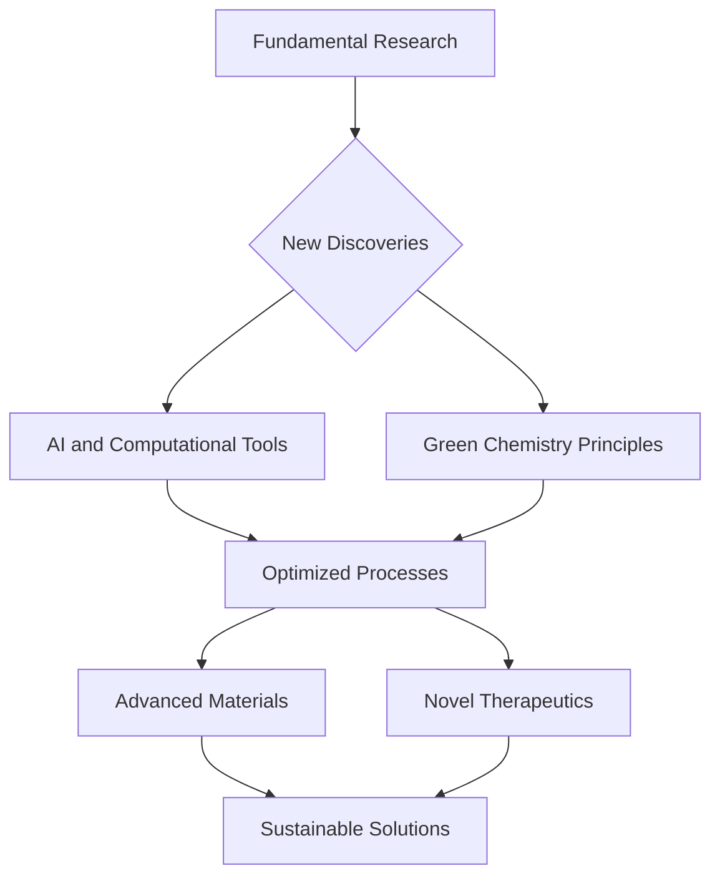

## Chemistry's Cutting Edge: Innovation and Impact in Mid-2026

As of June 2026, the world of chemistry is buzzing with transformative advancements, driven by a global push for sustainability, the accelerating power of artificial intelligence, and the continuous quest for novel materials. These interconnected trends are reshaping everything from drug discovery to environmental remediation.

One of the most significant shifts is the fervent embrace of **Green Chemistry and Sustainable Practices**. Researchers are developing sustainable electrochemical synthesis methods for drug discovery, drastically cutting down on toxic chemical use and boosting efficiency in producing therapeutic molecules. In a major win for environmental efforts, industrial-scale enzymatic recycling of plastics is now capable of breaking down complex plastics into their original building blocks, marking a true fresh start for materials and closing the loop on waste. The broader adoption of circular chemistry models and bio-based polymers is also gaining considerable momentum, aiming to displace fossil fuel-derived plastics.

**Artificial Intelligence (AI) and Machine Learning** are proving to be game-changers across various chemical domains. Generative AI is rapidly accelerating the discovery of new compounds and materials, with reports indicating a significant improvement in productivity. AI models are not only designing theoretical drug candidates but are also mapping out sustainable, green synthesis pathways to produce them in the lab. This integration of AI allows chemists to predict molecular behavior, reaction pathways, and material properties with unprecedented accuracy and speed, optimizing processes and saving valuable resources.

Meanwhile, the realm of **Advanced Materials** continues to yield remarkable innovations, none more celebrated recently than **Metal-Organic Frameworks (MOFs)**. The groundbreaking work on MOFs by Susumu Kitagawa, Richard Robson, and Omar Yaghi earned them the 2025 Nobel Prize in Chemistry. These intricate molecular constructions feature large internal cavities, allowing them to capture and store specific substances, catalyze chemical reactions, and even harvest water from desert air. Their potential for custom-made materials with new functions is enormous. Beyond MOFs, breakthroughs in self-healing coatings, powered by advances in microcapsule engineering and smart sensor integration, are poised to revolutionize infrastructure maintenance through predictive capabilities. New battery technologies, such as iron-air batteries, are also emerging, offering cost-effective and sustainable alternatives for energy storage.

These developments underscore chemistry's pivotal role in addressing humanity's grand challenges, from health and energy to environmental protection. The convergence of these fields promises a future where chemical innovation leads to a more sustainable and technologically advanced world.

