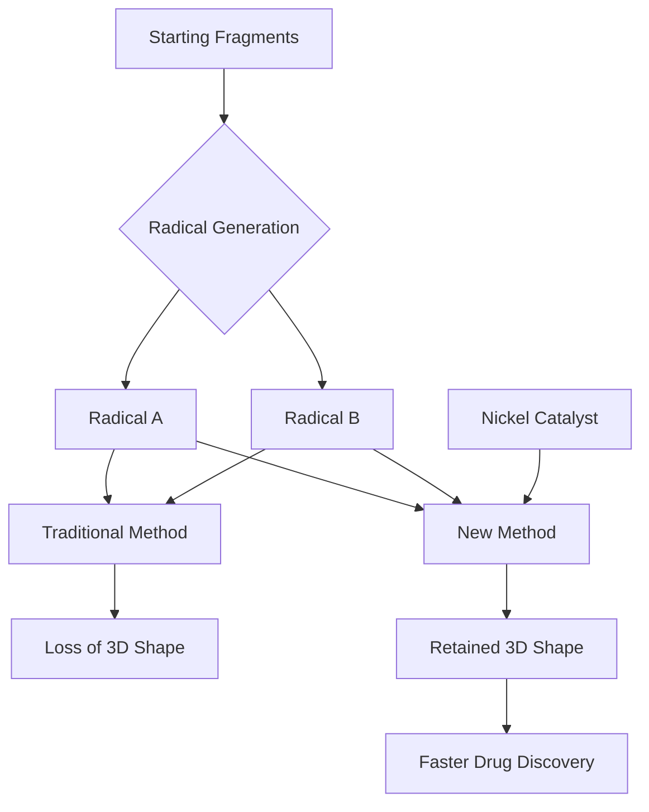

### Precision in 3D: Chemists Conquer Tricky Molecular Construction

**June 14, 2026** – A significant hurdle in organic chemistry, the precise assembly of complex three-dimensional molecules, has been overcome by researchers at Scripps Research. Published on June 4, 2026, a new method allows chemists to join highly reactive molecular fragments, known as free radicals, while preserving their crucial 3D shapes. This breakthrough, utilizing a simple nickel catalyst, promises to accelerate the discovery and synthesis of new drug candidates.

Many pharmaceutical drugs rely on specific 3D structures (chirality) to interact effectively with biological targets. Traditionally, forming carbon-carbon bonds using highly reactive radicals often leads to a loss of this desired 3D arrangement. The Scripps team's "stereoretentive radical-radical cross-coupling" reaction cleverly cages one radical on the nickel catalyst, allowing it to bond before its 3D orientation can scramble. This innovation provides a powerful new tool for chemists, enabling more direct and efficient synthesis of molecules with the exact 3D configurations needed for future medicines.

