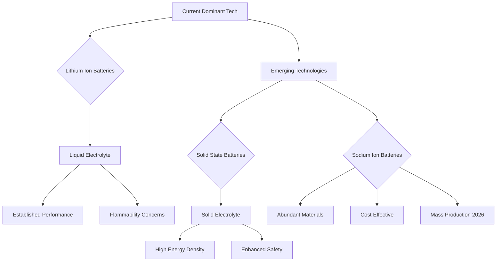

## Chemistry in the Fast Lane: The Latest in Energy Storage Breakthroughs (June 16, 2026)

As of June 16, 2026, the world of chemistry is buzzing with transformative advancements, particularly in the realm of energy storage. The global push for sustainability and electrification has ignited a furious pace of innovation, with breakthroughs in battery technology promising to redefine everything from electric vehicles to grid stability.

Leading this charge are **solid-state batteries (SSBs)**, which are rapidly transitioning from promising lab experiments to commercial reality. These next-generation cells replace the flammable liquid electrolytes found in traditional lithium-ion batteries with solid materials, inherently boosting safety and enabling significantly higher energy densities. We are seeing solid-state batteries move from the lab toward real products in 2026, though challenges like high cost and interface issues are still being addressed. Companies like Toyota, CATL, and BYD are actively involved, with semi-solid battery technologies already seeing deployment in some electric vehicles, offering extended ranges of up to 930 km and enhanced safety features. Full solid-state batteries are anticipated to achieve even greater energy densities, potentially reaching 400-500 Wh/kg commercially, and are expected to be in premium applications around 2027-2028, with mass production likely by 2030.

Another exciting development gaining significant traction is the emergence of **sodium-ion batteries (SIBs)**. These batteries offer a compelling alternative to lithium-ion due to the global abundance and lower cost of sodium. They also boast improved safety profiles and are proving competitive in terms of energy density, with breakthroughs achieving up to 175 Wh/kg and enabling ranges of approximately 500 km in electric vehicles. The world's largest battery manufacturer, CATL, has announced mass production of sodium-ion batteries using its "Naxtra" platform, with products expected to be used in cars from 2026, making them a significant part of the battery landscape today.

Beyond these two major players, innovation continues across the board. Research into **silicon anodes** is pushing the boundaries of energy density and charging speed for lithium-ion batteries, despite challenges with material expansion. The focus on **sustainable practices** is also paramount, with significant investments in battery recycling technologies aimed at extending material lifespans and reducing waste. The industry is in a transformative period, moving towards a future where various battery chemistries will coexist, each matched to specific applications for optimal performance and sustainability.

Here’s a simplified look at how battery technology is evolving:

The rapid advancements in battery chemistry, particularly in solid-state and sodium-ion technologies, are not just incremental improvements; they represent a fundamental shift in how we power our world. The ongoing research and commercialization efforts underscore chemistry's critical role in forging a more energy-independent and sustainable future.