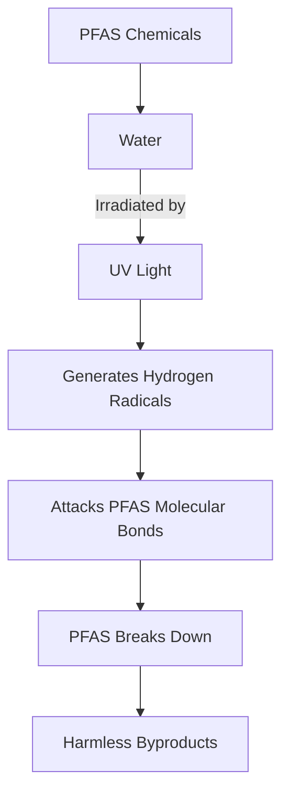

## Breakthrough in Battling "Forever Chemicals": UV Light Offers New Hope

**June 18, 2026** – In a significant stride for environmental chemistry, scientists have unveiled a novel method to break down stubborn "forever chemicals," also known as PFAS (per- and polyfluoroalkyl substances). These resilient compounds, found in countless consumer products, have long posed a global environmental and public health challenge due to their extreme stability and persistence in water, ecosystems, and even the human body.

Just this week, researchers announced a promising discovery: hydrogen radicals, generated by intense ultraviolet (UV) light, can effectively dismantle PFAS molecules without the need for additional chemicals. This breakthrough reveals a key mechanism that could pave the way for greener and more efficient technologies to permanently destroy these pervasive pollutants, rather than simply moving them from one place to another.

Previous efforts to degrade PFAS often relied on complex processes or additional reagents. However, by pinpointing hydrogen radicals as a dominant force in the degradation process, scientists now possess a clearer understanding of the underlying chemistry. This insight is crucial for developing targeted and more effective treatment technologies to tackle one of the most persistent environmental contaminants facing our world today.

The implications are substantial, offering a beacon of hope in the ongoing fight against widespread PFAS contamination and its associated health risks.

Here's a simplified look at the process:

