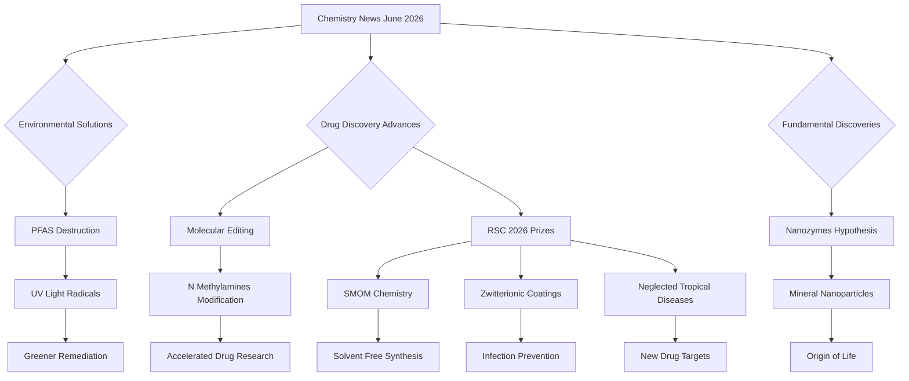

## Chemistry in the News: June 2026 Highlights

As of June 19, 2026, the world of chemistry is buzzing with innovations addressing critical global challenges, from environmental remediation to drug discovery and even the fundamental questions of life's origins. Here's a concise look at some of the most impactful recent developments.

One significant breakthrough offers new hope in the fight against pervasive "forever chemicals." Researchers have discovered that hydrogen radicals, generated by intense UV light, can effectively break down stubborn PFAS compounds without the need for additional chemicals. This finding identifies a crucial mechanism that could pave the way for greener and more efficient technologies to permanently eliminate these pollutants from our environment.

In the realm of pharmaceuticals, chemists at the University of Vienna have achieved a remarkable feat in modern drug discovery. They can now directly modify N-methylamines, a vital class of molecules, using simple alkenes. This groundbreaking "molecular editing" approach allows for the targeted transformation of molecules rather than rebuilding them from scratch, potentially accelerating the development of new therapeutics by enabling the easy preparation of hundreds of molecular variants.

The Royal Society of Chemistry (RSC) has also recognized outstanding contributions with its 2026 Prizes. Oxford researchers were honored for their work, including Professor Yimon Aye's pioneering methods for mapping chemical signaling events and a team's advancements in solid-state molecular organometallic (SMOM) chemistry, which offers a solvent-free approach to synthesizing highly reactive transition metal complexes. Additionally, a UCLA-led team received the RSC 2026 Materials Chemistry Horizon Prize for translating zwitterionic polymer surface-coating technology into FDA-cleared medical devices designed to prevent infections. Durham researchers were also celebrated with a Horizon Prize for developing innovative tools to identify drug targets for neglected tropical diseases like leishmaniasis and Chagas disease.

Further expanding our understanding of fundamental processes, scientists have proposed a radical new theory for the origin of life on Earth. This hypothesis suggests that tiny mineral nanoparticles, dubbed "nanozymes," may have acted as natural catalysts and energy processors, converting Earth's early chemistry into the initial building blocks of life through a process termed "inorganic photosynthesis".

The American Chemical Society (ACS) will also acknowledge companies and researchers in August for their advancements in sustainability and healthcare, including non-fluorine photoresists for semiconductors and antiviral developments, reflecting chemistry's ongoing role in societal progress. These developments underscore the rapid evolution and impactful contributions of chemical sciences globally.

