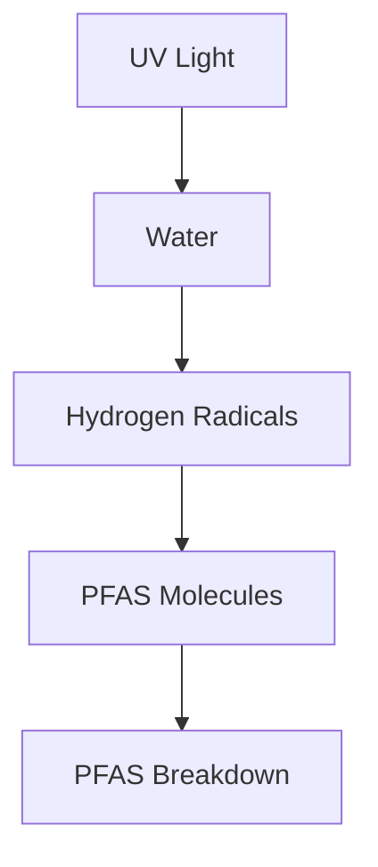

## Chemistry in the Spotlight: New Hope for "Forever Chemicals"

As of June 20, 2026, the world of chemistry continues its rapid pace of innovation, addressing critical global challenges. One of the most significant recent developments offers a promising avenue in the battle against ubiquitous and persistent "forever chemicals," formally known as per- and polyfluoroalkyl substances (PFAS).

Just this week, researchers from Aarhus University unveiled a breakthrough in the degradation of PFAS compounds. They discovered that hydrogen radicals, generated by intense ultraviolet (UV) light, can effectively break down these stubborn chemicals without the need for additional chemical agents. This finding challenges previous assumptions about PFAS degradation mechanisms, highlighting the central role of hydrogen radicals derived from water when exposed to UV light. This clearer understanding of the underlying chemistry is crucial for developing more effective and greener treatment technologies to permanently destroy these pollutants, rather than merely removing them.

PFAS have long posed an immense environmental and public health concern due to their exceptional stability, allowing them to persist in water, ecosystems, and even the human body for decades. This new insight represents a critical step forward in addressing one of the most challenging pollution problems of our time.

Beyond environmental remediation, the field of chemistry is also being revolutionized by artificial intelligence. Platforms like Yale's MOSAIC, developed in January 2026, are leveraging AI to generate experimental procedures for chemical synthesis, including for compounds that don't yet exist, significantly accelerating drug discovery and materials science. Similarly, EPFL's Synthegy system, introduced in May 2026, allows chemists to guide synthesis and reaction planning using natural language, with AI algorithms evaluating potential solutions. These advancements underscore a future where AI acts as a powerful co-pilot, enhancing efficiency and precision in chemical research and development.

The ongoing advancements, whether in tackling persistent pollutants or revolutionizing discovery through AI, demonstrate chemistry's pivotal role in shaping a sustainable and healthier future.

