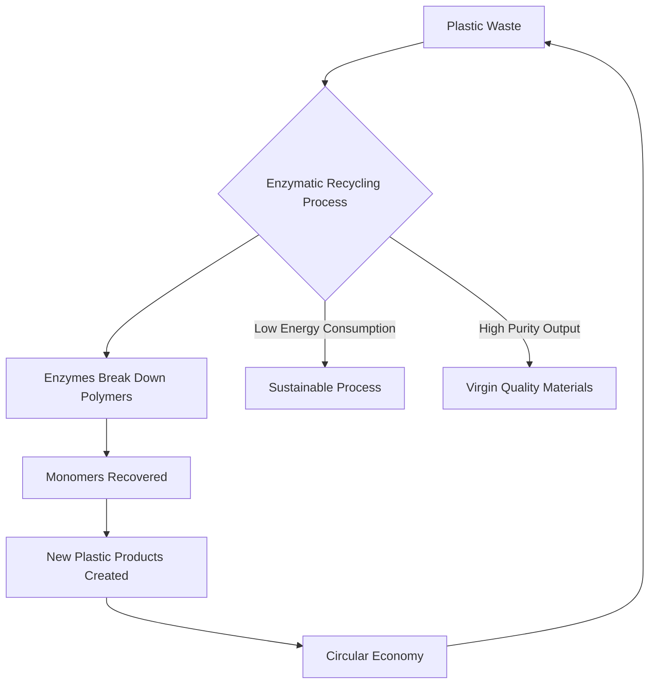

## Chemistry's Green Revolution: Enzymes Tackle Plastic Waste Head-On

**June 21, 2026** – The fight against global plastic pollution is seeing significant advances, with enzymes emerging as a powerful and sustainable weapon. Today, the chemistry community continues to buzz with developments in enzymatic recycling, a technology poised to revolutionize how we manage plastic waste and usher in a truly circular economy.

Just recently, scientists have made major progress in engineering and optimizing enzymes to efficiently break down common plastics like PET, which is prevalent in bottles, food packaging, and textiles. This innovative approach offers a compelling alternative to traditional recycling methods, which often demand high temperatures, significant energy, and can lead to a degradation in plastic quality over time.

One of the most compelling advantages of enzyme-based recycling is its sustainability. These biological catalysts can operate at lower temperatures and under milder conditions, drastically reducing energy consumption and carbon emissions. By breaking plastics down into their original chemical building blocks, these monomers can then be re-polymerized into new, high-quality plastic products without loss of integrity. This creates a closed-loop system, directly supporting a circular economy where plastics are continuously reused instead of being discarded.

Breakthroughs in cost-competitiveness are also accelerating adoption. A collaborative effort in June 2025, for instance, significantly reduced the costs and energy consumption associated with enzyme-based recycling, making it a viable and even cheaper alternative to producing virgin plastics. Projects like the EU-funded ENZYCLE are further advancing microplastic degradation systems, demonstrating substantial weight loss in microplastics like PET and PE through enzymatic and microbiological processes.

As global plastic production continues to rise, the demand for sustainable packaging, eco-friendly manufacturing, and green technologies is increasing rapidly. Major industries are closely watching these developments, with experts optimistic that enzyme-powered recycling will become commercially scalable in the coming years, driven by continuous advancements in biotechnology and industrial chemistry.

This ongoing green revolution in chemistry represents a crucial step toward mitigating plastic pollution, creating smarter waste management systems, and fostering a more environmentally responsible future.

