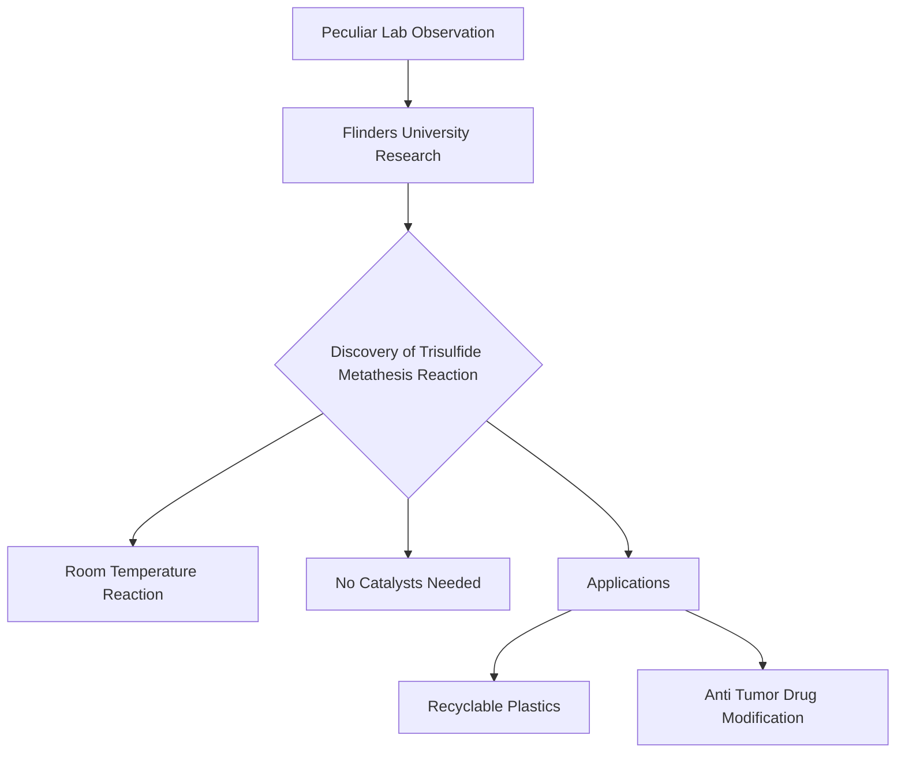

## Breakthrough in Bond Chemistry: The Spontaneous Trisulfide Metathesis Reaction

In a significant advance for fundamental chemistry, researchers at Flinders University in Australia have unveiled a new type of sulfur-sulfur bond exchange reaction, dubbed the "trisulfide metathesis reaction." This discovery, announced on March 13, 2026, challenges previous understandings of sulfur chemistry by demonstrating a spontaneous rearrangement of bonds at room temperature, without the need for catalysts, heat, or light.

Traditionally, sulfur-sulfur bonds, particularly in chains of three sulfur atoms (trisulfides), require external energy or chemical assistance to break and reform. However, this newly identified reaction occurs simply by dissolving molecules containing trisulfide chains in certain solvents, such as dimethylformamide. This peculiar observation in laboratory experiments led the interdisciplinary team to a breakthrough that could have far-reaching implications.

The spontaneous nature of the trisulfide metathesis reaction opens doors to more efficient and environmentally friendly chemical processes. Early applications of this discovery are already promising, including the development of novel recyclable plastics and the selective modification of anti-tumor drugs. This ability to manipulate sulfur bonds under mild conditions marks a crucial step forward in green chemistry and materials science, potentially revolutionizing how we approach synthesis and molecular design.

