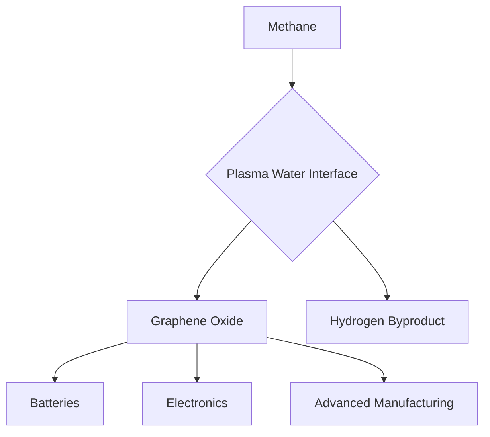

## Chemistry in Motion: AI, Green Production, and the Materials Revolution of 2026

As of July 4, 2026, the world of chemistry is buzzing with innovations, fundamentally reshaping industries and driving us towards a more sustainable future. From artificial intelligence accelerating eco-friendly synthesis to groundbreaking methods for producing advanced materials, the pace of discovery is electrifying.

One of the most transformative shifts is occurring at the intersection of **Green Chemistry and Artificial Intelligence**. In 2026, generative AI tools and predictive language models have become indispensable, radically minimizing waste in chemical synthesis. These AI-driven platforms simulate millions of reaction pathways through "digital twin environments," screening for atmospheric toxicity, energy consumption, and atom economy *before* any physical reagents are touched. This predictive lifecycle design has reportedly cut benchtop chemical waste by an estimated 40% in advanced research laboratories. Complementing this, the biocatalysis revolution is gaining significant momentum, with engineered enzymes designed to execute complex organic transformations under mild, ambient conditions. These bio-catalysts offer near-perfect stereoselectivity and entirely eliminate the toxic heavy-metal footprint associated with traditional catalysts.

Adding to the week's exciting news, a significant breakthrough in **graphene oxide production** was announced just yesterday, July 3, 2026. Researchers at Texas A&M University have unveiled a new, scalable method to synthesize high-purity, single-layer graphene oxide from methane using a nonthermal plasma-water interface. This unexpected discovery, which emerged from a hydrogen production project, not only offers a potentially lower-cost and more environmentally friendly alternative to conventional graphite-based methods but also simultaneously yields hydrogen as a valuable byproduct. This innovative process directly converts methane into graphene oxide—a critical nanomaterial for batteries, electronics, and advanced manufacturing—instead of converting carbon into carbon dioxide, creating both energy and advanced materials concurrently.

These advancements highlight chemistry's pivotal role in addressing global challenges, demonstrating how smart technologies and novel approaches are paving the way for cleaner, more efficient, and more sustainable industrial practices.

