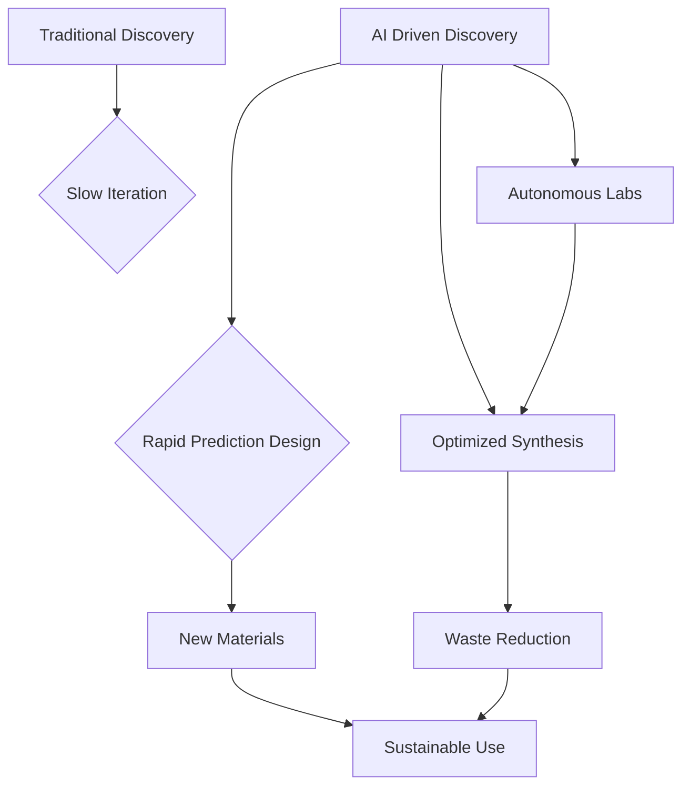

## AI Pioneers a New Era in Chemistry: Accelerated Discovery and Sustainable Futures

**July 8, 2026** – The world of chemistry is undergoing a profound transformation, with artificial intelligence (AI) emerging as a powerful catalyst for innovation. As of mid-2026, AI is not just augmenting, but actively revolutionizing the discovery of new materials and the pursuit of sustainable chemical processes, compressing timelines and driving greener solutions.

Recent developments highlight the exponential growth and impact of AI in materials discovery. The market for AI in materials discovery is projected to grow significantly, reaching nearly a billion dollars in 2026, driven by increased adoption of computational modeling, vast digital materials datasets, and surging investments in AI research. This shift is moving beyond passive screening of existing databases. Leading research, including work by IBM and Hong Kong Quantum AI Lab Limited, now focuses on "active inverse-design workflows" where AI generative chemistry, leveraging deep generative models and large language models (LLMs), proposes entirely new material structures optimized for specific performance requirements.

Tools like Argonne National Laboratory's recently unveiled ChemGraph framework are democratizing computational chemistry by using AI to streamline complex workflows, making advanced material simulations accessible to non-experts. These AI-driven approaches are drastically reducing the reliance on traditional, time-consuming trial-and-error experimentation, accelerating the journey from concept to application.

The integration of AI also plays a pivotal role in the ongoing push towards sustainable chemistry. The American Chemical Society (ACS) recently announced its 2026 Green Chemistry Challenge Award winners, recognizing breakthroughs in areas such as recyclable polyurethanes, cleaner pharmaceutical manufacturing, and sustainable crop protection—all emblematic of chemistry's commitment to reducing hazardous substances and waste. Concurrently, the International Sustainable Chemistry Collaborative Centre (ISC3) Innovation Challenge 2026, focused on "Sustainable Chemistry & Electronics," has highlighted finalists pioneering bio-based adhesives, solvent-free magnet recycling, and AI-driven platforms for electronics traceability. These initiatives underscore how AI is not just speeding up discovery but also guiding it towards environmentally responsible outcomes, such as designing greener synthesis pathways and identifying alternative, bio-based materials.

The fusion of AI with chemistry promises a future where materials are discovered faster, designed with inherent sustainability, and manufactured with minimal environmental impact.

