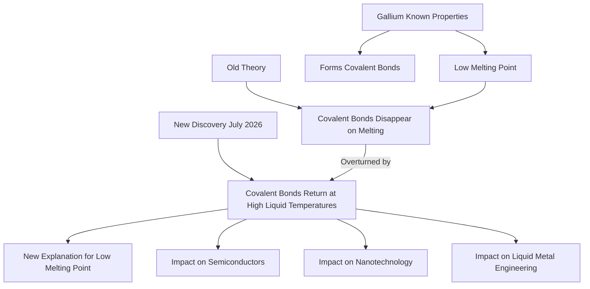

## Gallium's 150-Year Mystery Unraveled: A Textbook Rewrite for Chemistry

**July 09, 2026**

For nearly 150 years, the quirky metal gallium has held a secret, defying textbook explanations of its atomic behavior. Now, scientists have finally unraveled this long-standing mystery, a breakthrough poised to influence fields from semiconductors to nanotechnology. The discovery, reported on July 7, 2026, overturns decades of accepted theory regarding how gallium's atomic bonds behave at high temperatures.

Gallium is known for several unusual properties, including its remarkably low melting point – famously able to melt in a cup of hot tea. It's also one of the few substances that is less dense as a solid than as a liquid, much like ice floating on water. Furthermore, its atoms naturally pair into 'dimers' and form covalent bonds, a type of bonding more typically seen in nonmetals than metals.

The long-held assumption was that these covalent bonds disappeared entirely once gallium melted. However, researchers from the University of Auckland have made a groundbreaking observation: while these bonds do vanish at the melting point, they unexpectedly re-form when the liquid is heated to even higher temperatures. This revelation challenges conventional understanding and provides a new explanation for gallium's unusually low melting point. The breaking apart of bonds at melting point, and their subsequent return at higher temperatures, is now thought to increase entropy, a measure of disorder, facilitating the melting process.

This fundamental shift in our understanding of gallium's atomic structure and behavior could lead to significant advancements. The implications are far-reaching, promising new avenues in the development of semiconductors, pushing the boundaries of nanotechnology, and refining the engineering of liquid metals for various applications.

The solving of this enduring chemical enigma highlights how even well-established scientific principles can be refined with new experimental evidence, continually expanding our knowledge of the elements that compose our world.

