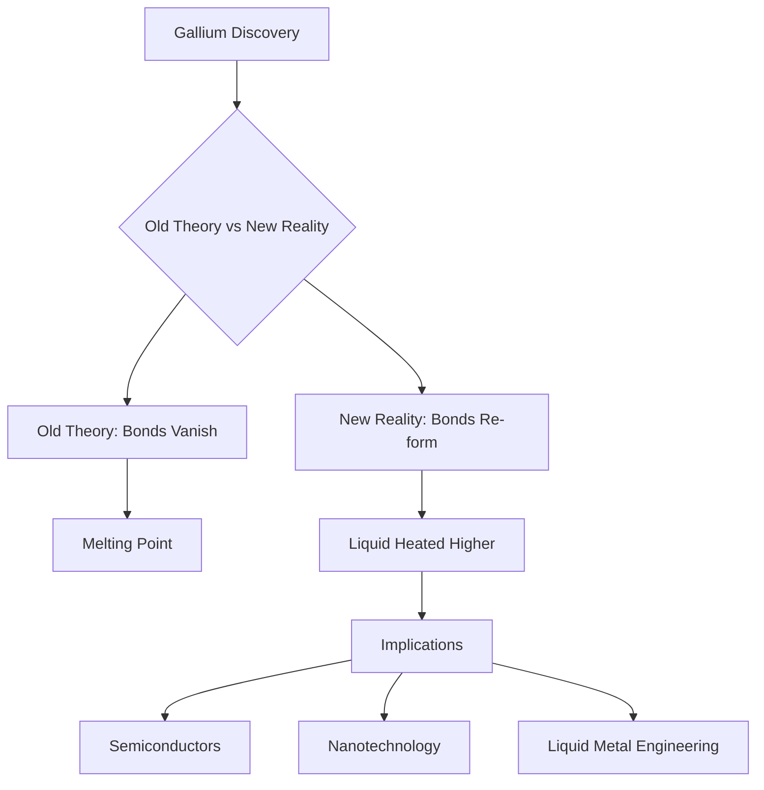

## Gallium's Long-Standing Atomic Mystery Unraveled, Rewriting Textbooks

**Buffalo, NY – July 10, 2026** – A fundamental understanding of the metallic element gallium, a staple in semiconductors and electronic technologies, has been profoundly updated by a recent discovery, challenging nearly 150 years of scientific consensus. Researchers have found that gallium's unusual atomic bonds, long believed to vanish upon melting, surprisingly re-form at higher temperatures in its liquid state. This breakthrough, published on July 7, 2026, by a team including the University of Auckland, promises to rewrite chemistry textbooks and unlock new possibilities in materials science and engineering.

Gallium is known for its remarkably low melting point, allowing it to liquefy in a warm hand, and for its unique characteristic of being less dense as a solid than as a liquid, much like water. Its atoms naturally form pairs, or "dimers," held together by covalent bonds—a bonding type more typical of nonmetals. The conventional wisdom held that these covalent bonds broke permanently when gallium melted. However, the new study overturns this assumption, revealing that while these bonds indeed disappear at the melting point, they unexpectedly reappear as the liquid metal is heated to even higher temperatures.

This revelation provides a fresh explanation for gallium's distinctive properties, moving beyond previous, incomplete theories. The findings could pave the way for significant advancements in critical areas such as the design of new semiconductors, innovations in nanotechnology, and refined approaches to liquid metal engineering. This highlights how even long-accepted scientific principles can be refined and reshaped by rigorous modern inquiry.

