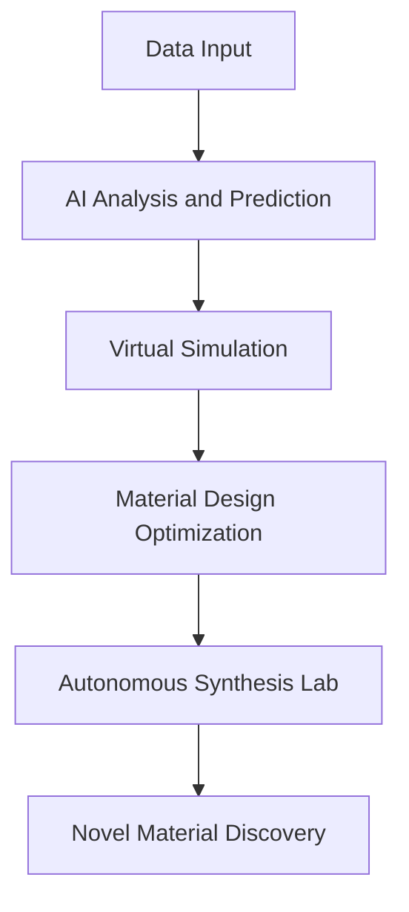

## AI Propels Chemistry into an Autonomous Future

**July 11, 2026** – Chemistry is experiencing a profound transformation, with artificial intelligence (AI) emerging as a pivotal force, accelerating discovery and streamlining research like never before. This year, the integration of AI, machine learning, and autonomous laboratories is not just a trend but an "actual live news" revolution, fundamentally changing how new materials and chemical processes are developed.

AI is rapidly reshaping research and development by analyzing vast datasets, identifying patterns humans might miss, and predicting reactions with unprecedented speed and accuracy. This efficiency significantly cuts down the time required for R&D in chemical and materials science. Tools leveraging large language models (LLMs) are now assisting in designing novel compounds and optimizing processes, allowing scientists to test hypotheses virtually before physical synthesis.

A key development is the rise of autonomous labs, where robots guided by AI are taking over experimental tasks. For instance, the A-Lab at Lawrence Berkeley National Laboratory, since its 2023 launch, has collaborated with the Materials Project to synthesize novel materials with promise for future technologies. This closed-loop discovery approach, moving from prediction to autonomous execution and refinement, represents a paradigm shift. Companies like IBM are also advancing constrained generative AI foundation models, emphasizing factors like synthesizability and cost to harden these methods for industrial use, as seen in their January 2026 filings. Furthermore, Argonne National Laboratory's new ChemGraph framework, powered by the Aurora exascale supercomputer, simplifies complex chemistry workflows for non-experts, making advanced computational chemistry accessible through AI.

The impact extends to sustainable chemistry, where AI helps in the inverse design of novel biodegradable polymers, green alloys, and carbon-capture materials to meet stringent environmental constraints. This shift promises to unlock radical solutions and usher in a new era of innovation.

The workflow for material discovery is evolving:

As we move through 2026, AI's role in chemistry is only set to expand, promising a future where chemical discovery is faster, smarter, and more sustainable.