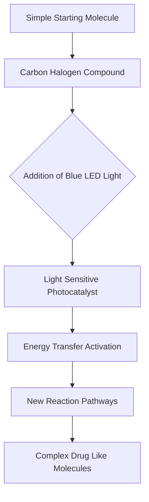

## Chemistry in the Limelight: Innovations Shaping Our World This July

As of July 17, 2026, the world of chemistry continues its relentless march forward, delivering breakthroughs that promise to revolutionize medicine, environmental protection, and sustainable practices. The pace of discovery is electrifying, showcasing how fundamental chemical insights translate into tangible benefits for humanity.

One of the most exciting recent developments comes from the realm of drug discovery. Researchers have developed a groundbreaking visible-light-driven method that allows chemists to construct more complex, drug-like molecules in fewer steps. By harnessing blue LEDs and a light-sensitive catalyst, scientists can make two neighboring changes to a molecule simultaneously, significantly speeding up the synthesis of intricate structures crucial for new medicines. This elegant approach overcomes limitations of traditional methods, which often require numerous costly and time-consuming reactions, and avoids the damaging effects of higher-energy UV light.

In another significant medical advance, scientists have finally unraveled nature's secret to building better cancer drugs. Decades of mystery surrounding how bacteria naturally produce multiple versions of powerful anti-cancer compounds, including the FDA-approved Romidepsin, have been solved. Researchers discovered "docking domains" that act as molecular connectors, allowing bacterial enzymes to "mix and match" components to assemble diverse drug variants. Reproducing this natural mechanism in the lab opens new avenues for designing future cancer therapies with enhanced precision and efficacy.

Beyond medicine, chemistry is also tackling pressing environmental challenges. Recent research highlights the hidden pollution left behind by fireworks, impacting both air and water quality beyond the visible smoke. On a more optimistic note, a surprisingly simple fuel modification, involving mixing small amounts of water into diesel, has been shown to dramatically cut diesel engine pollution by over 60%. Furthermore, a new solid-state material capable of converting visible sunlight into higher-energy UV light offers promising applications for cleaner air purification and solar-driven chemistry. Even the stubborn "forever chemicals" (PFAS) are facing a new threat, as researchers found that hydrogen radicals generated by intense UV light can break them down without additional chemicals.

These advancements underscore chemistry's pivotal role in addressing global challenges, from health to sustainability, constantly pushing the boundaries of what's possible.

