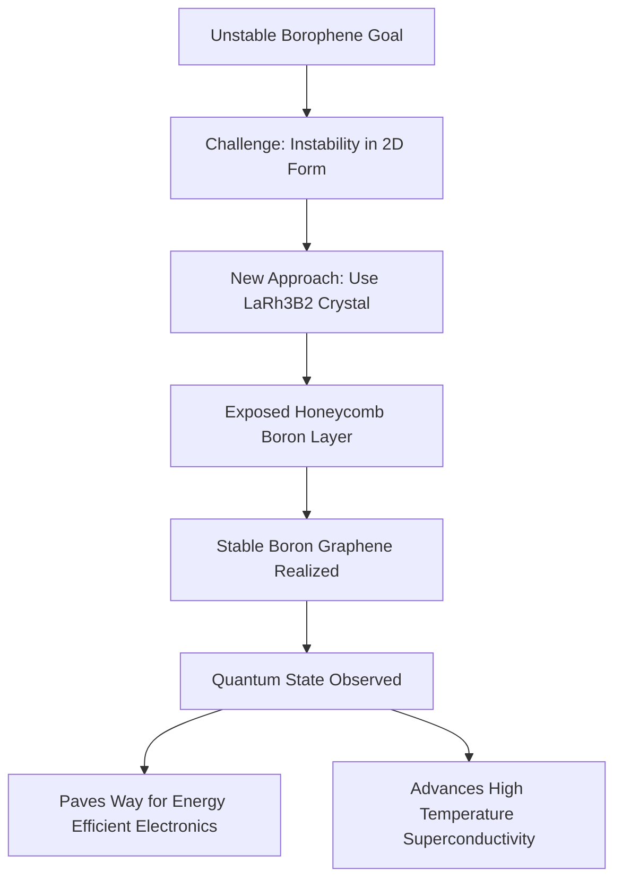

## Boron's New Frontier: Unlocking Stable "Boron Graphene" for Next-Gen Electronics

**July 18, 2026** – In a significant leap forward for materials science, researchers have achieved a major milestone: creating a stable version of "boron graphene," or borophene, a material long envisioned to revolutionize electronics. This breakthrough, published recently on July 3, 2026, by scientists from Tohoku University, not only stabilizes this elusive material but also reveals a new quantum state with immense potential for future technology.

For years, the promise of borophene – a two-dimensional sheet of boron atoms – has captivated chemists and physicists. Unlike its carbon cousin, graphene, borophene's stronger electron interactions were theorized to unlock exotic quantum phenomena, including the possibility of high-temperature superconductivity and more energy-efficient electronic devices. However, the inherent instability of an isolated, ideal honeycomb borophene structure has made its realization a formidable challenge.

The Tohoku University team circumvented this obstacle with an ingenious approach. Instead of attempting to synthesize an unstable free-standing sheet of boron atoms, they discovered a way to expose a naturally occurring honeycomb boron layer already present within a stable three-dimensional crystal known as LaRh₃B₂. This method allowed them to realize stable boron graphene.

This pioneering research is poised to have profound implications across various technological fields. The successful creation of stable boron graphene, coupled with the observation of a new quantum state, opens unprecedented pathways for developing advanced 2D quantum materials. These materials could lead to significantly more energy-efficient electronic devices and accelerate the quest for high-temperature superconductors, transforming computing and energy transmission as we know it.

Here's a simplified look at the process:

