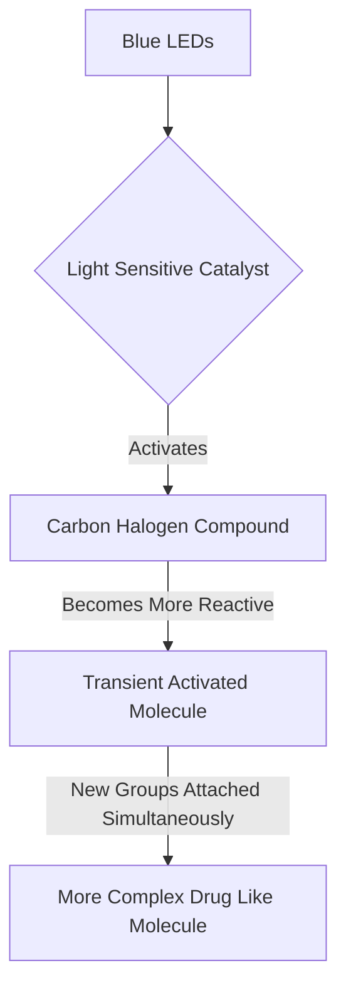

## Chemistry's Latest Spark: Blue Light Unlocks New Avenues in Drug Discovery

As of July 19, 2026, the world of chemistry continues its rapid evolution, pushing boundaries in sustainable practices, novel materials, and therapeutic advancements. Among the most recent and exciting developments is a breakthrough in organic synthesis, leveraging the power of visible blue light to accelerate drug discovery.

Researchers have unveiled a novel, visible-light-driven method that promises to streamline the creation of complex drug-like molecules. Published in the journal *Science* just days ago, this innovation addresses a long-standing challenge in pharmaceutical chemistry: efficiently building intricate molecular structures. Historically, achieving such complexity often necessitated numerous, costly, and time-consuming reaction steps.

The new technique utilizes readily available blue LEDs – similar to those found in aquariums – in conjunction with a light-sensitive catalyst and common carbon-halogen compounds. When activated by blue light, the catalyst triggers the starting molecule into a transient, highly reactive state. This brief window of reactivity allows chemists to attach new groups to *two adjacent* carbon atoms simultaneously in a single operation. This unprecedented dual modification significantly reduces the steps required to introduce structural complexity, potentially accelerating the development of more potent and selective medicines.

This innovation is a testament to the ongoing drive for efficiency and elegance in chemical synthesis. Beyond this specific breakthrough, the broader chemistry landscape is buzzing with activity. We're seeing continuous progress in sustainable solutions, such as new methods for breaking down stubborn PFAS "forever chemicals" using UV light and advancements in converting sunlight and waste into clean hydrogen fuel. The work on Metal-Organic Frameworks (MOFs), which garnered the Nobel Prize in Chemistry last year, also continues to evolve with ongoing research into their applications for gas separation and absorption.

The ability to manipulate molecules with greater precision and fewer steps, as demonstrated by the blue light method, underscores chemistry's vital role in addressing global health and environmental challenges.

