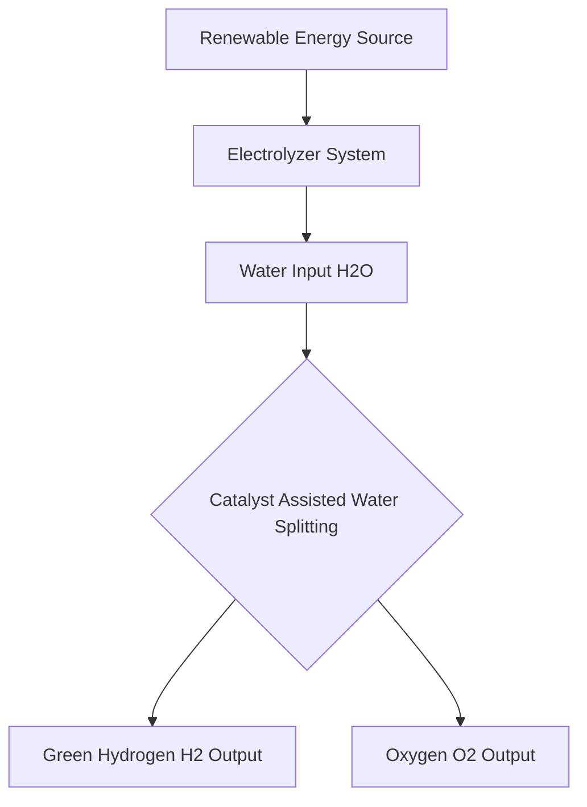

## Catalyst Breakthrough Paves Way for Cheaper, Greener Hydrogen

**July 20, 2026** – The quest for sustainable energy just received a significant boost with exciting new developments in green hydrogen production. As the world pushes for decarbonization, efficient and affordable methods to generate hydrogen from renewable sources are more critical than ever. Recent breakthroughs in catalyst design are bringing this future closer to reality.

One of the most compelling pieces of news comes from the Centre for Nano and Soft Matter Sciences (CeNS), where scientists have unveiled a revolutionary catalyst. This innovative material possesses a remarkable ability: its structure can transform itself during the water electrolysis process, precisely at the moment it triggers the splitting of water to produce green hydrogen. This self-adapting characteristic holds immense promise for developing highly efficient, durable, and cost-effective hydrogen production systems.

Traditional water electrolysis for green hydrogen often relies on expensive and rare materials as catalysts, such as iridium and platinum, which operate under challenging acidic conditions. The discovery of catalysts that can either operate efficiently without these rare elements or enhance the process through novel mechanisms, like the self-transforming catalyst from CeNS, marks a pivotal shift. Such advancements are crucial for scaling up green hydrogen production to industrial levels, making it a viable alternative to fossil fuels in various sectors, from transportation to heavy industry.

The fundamental process of generating green hydrogen involves using electricity from renewable sources to split water molecules. The catalyst plays a vital role in speeding up this reaction, making it energetically feasible and economically attractive. By introducing a catalyst that can optimize its structure on the fly, researchers are effectively unlocking new levels of performance and stability, overcoming some of the long-standing hurdles in this field. This propels us closer to a future powered by clean, abundant hydrogen.

Beyond the CeNS discovery, the field of green chemistry is vibrant with innovation. Researchers continue to explore new materials and methods, including the use of iron oxide-based catalysts that double hydrogen production efficiency and advanced mechanical and chemical recycling for plastics. Furthermore, the integration of artificial intelligence is accelerating the discovery of new materials, including those crucial for next-generation energy storage and catalytic processes.

These developments underscore a collective global effort to harness chemistry for a sustainable planet, making "green" not just an aspiration, but an increasingly tangible reality.