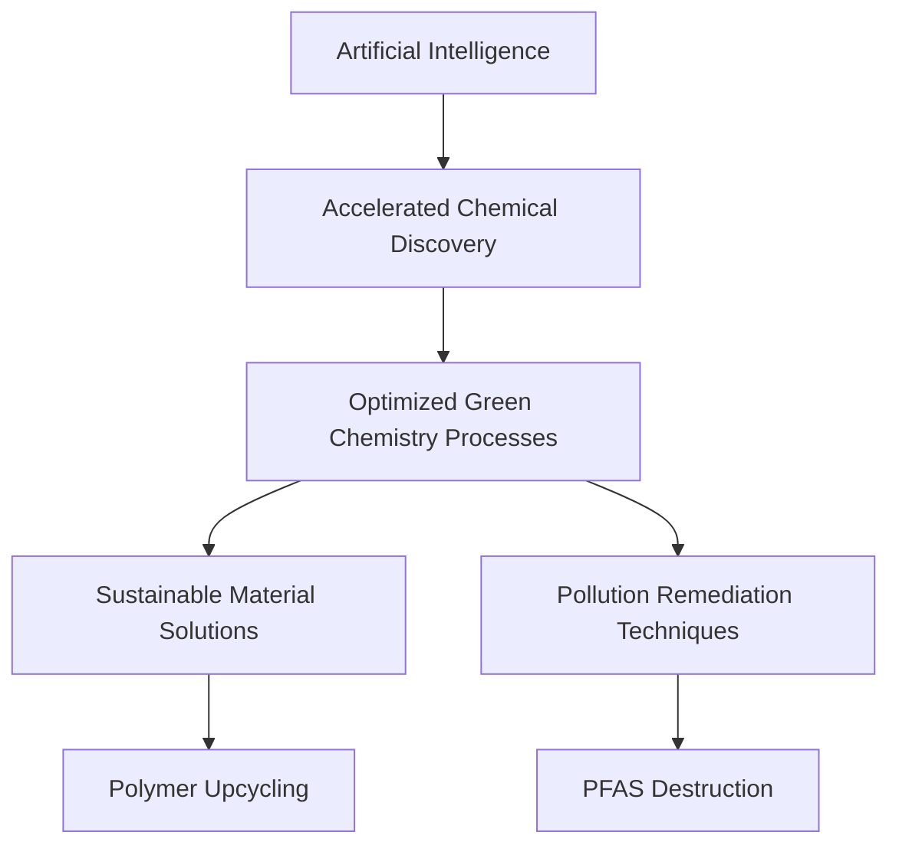

## Chemistry in Motion: AI and Sustainability Drive 2026 Innovations

As of July 21, 2026, the world of chemistry is buzzing with transformative advancements, largely propelled by the twin engines of artificial intelligence (AI) and a fervent commitment to sustainability. Researchers globally are leveraging cutting-edge computational power to tackle some of our planet's most pressing challenges, from pollution to resource scarcity.

One of the most significant overarching trends is the rapid integration of AI and machine learning into every facet of chemical research and development. AI-accelerated computational chemistry is no longer just an academic tool; it's becoming an industrial platform, speeding up molecular design, predicting reaction outcomes, and optimizing synthetic routes at speeds previously unimaginable. This digital transformation, sometimes dubbed "ChemTech 4.0," enhances efficiency and productivity, paving the way for smarter and more efficient industrial futures.

In parallel, green chemistry continues to deliver crucial innovations aimed at reducing environmental impact and fostering a circular economy. Recent breakthroughs underscore this commitment. Just this month, scientists announced promising new methods to destroy PFAS, the persistent "forever chemicals" that have long plagued water systems. These novel approaches, which include using collapsing vapor bubbles for extreme heat and reactive molecules, or hydrogen radicals generated by intense UV light, offer a glimmer of hope in remediating widespread contamination.

Furthermore, advancements in polymer upcycling are making significant strides towards a waste-free future. Innovative platforms are enabling the solid-state recycling of complex materials like polyurethane foams and elastomers, which were traditionally deemed non-recyclable. These processes convert them into valuable covalent adaptable networks without harsh chemicals or extensive depolymerization. Such developments align perfectly with the push for sustainable manufacturing and resource efficiency.

The synergy between AI and sustainable chemistry is undeniable. AI models are crucial in identifying and optimizing the less toxic reagents and lower-carbon footprint synthetic routes essential for green chemistry practices. As we move forward, this powerful combination promises to unlock even more innovative solutions, reshaping industries from pharmaceuticals to energy.

