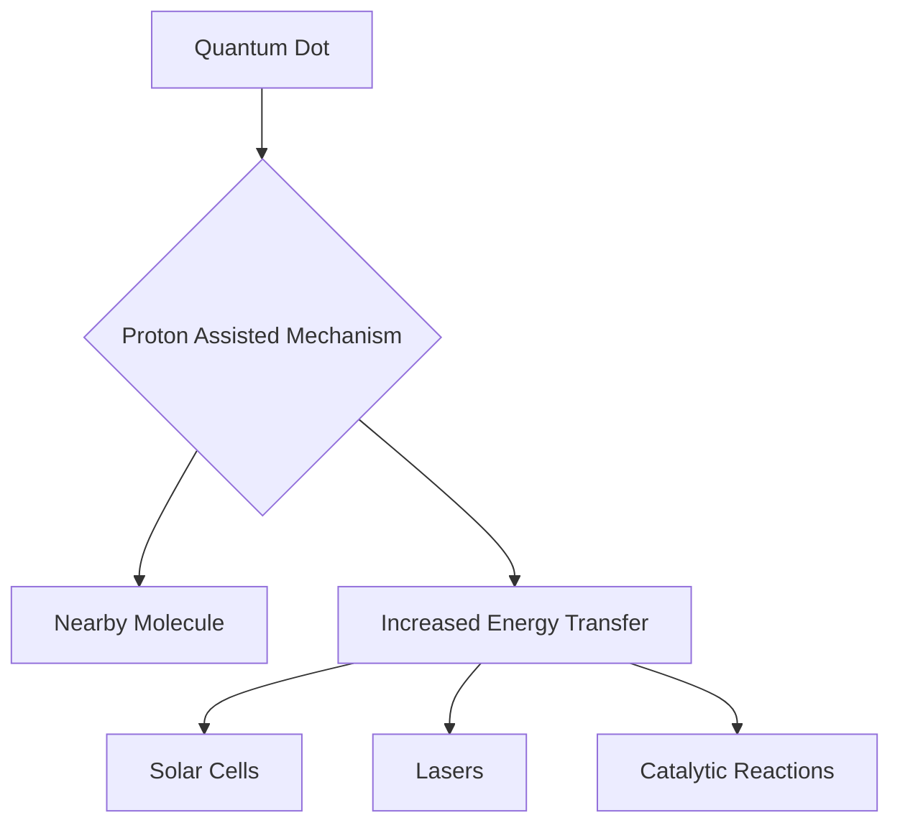

### Chemistry Unlocked: Quantum Leaps and Forever Solutions Mark Mid-2026

As of July 22, 2026, the world of chemistry continues to buzz with groundbreaking discoveries, pushing the boundaries of what's possible in energy, environmental remediation, and fundamental understanding. Recent developments highlight both the intricate dance of quantum mechanics and innovative approaches to tackle persistent pollution.

One of the most exciting announcements today comes from researchers who have unveiled a strange quantum effect dramatically boosting energy transfer. Scientists discovered a proton-assisted mechanism that significantly improves how triplet energy moves between quantum dots and nearby molecules. This fascinating process involves a proton briefly shifting its position to coordinate electron movement before returning to its original spot, acting as a "quantum-driven shuttle." Published in *Nature Materials*, this breakthrough, led by the Dalian Institute of Chemical Physics, Chinese Academy of Sciences, holds immense potential for fine-tuning the efficiency of solar cells, enhancing lasers, and optimizing catalytic reactions.

Meanwhile, the urgent challenge of "forever chemicals" (PFAS) is being met with promising new solutions. Just days ago, on July 19, 2026, it was reported that scientists are testing two powerful new ways to destroy these stubborn per- and polyfluoroalkyl substances in water. One method employs hydrodynamic cavitation, which uses collapsing vapor bubbles to generate extreme heat and reactive molecules, while the other utilizes cold plasma and rising gas bubbles to both extract and break apart PFAS molecules. These innovative approaches from the Helmholtz-Zentrum Dresden-Rossendorf offer a glimmer of hope in remediating widespread PFAS contamination.

These recent advancements underscore the dynamic and crucial role chemistry plays in shaping a sustainable and technologically advanced future.

