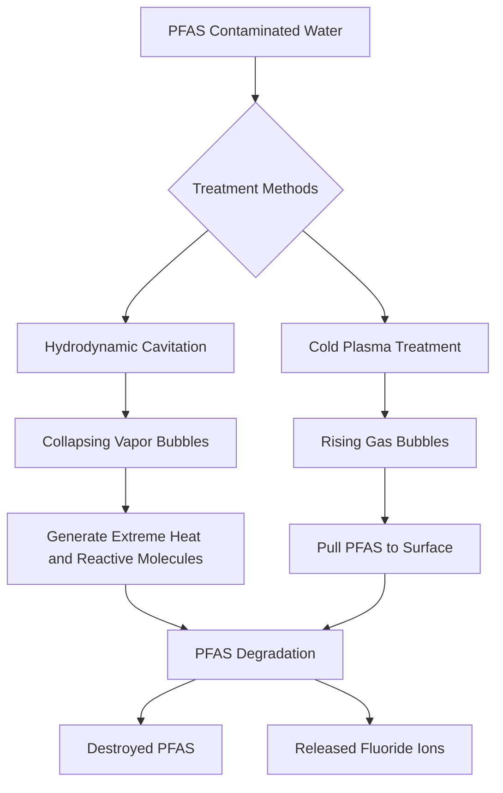

## Chemistry in Real Time: Tackling Forever Chemicals and Accelerating Discovery

**July 26, 2026** – The world of chemistry is a dynamic frontier, constantly unveiling new solutions to pressing global challenges. As of late July 2026, researchers are making significant strides in areas ranging from environmental remediation to advanced materials and even astrochemical revelations.

One of the most impactful recent developments is the innovative work being done to eliminate per- and polyfluorofluoroalkyl substances (PFAS), commonly known as "forever chemicals." These persistent pollutants accumulate in water and resist traditional treatment methods, posing long-term environmental and health risks. Scientists are now actively testing two promising technologies to tackle this issue. One method utilizes collapsing vapor bubbles to generate extreme heat and reactive molecules capable of breaking down PFAS. The other approach combines cold plasma with rising gas bubbles to both extract PFAS to the surface and then degrade them. These advancements offer a beacon of hope for cleaning contaminated water sources.

Beyond environmental cleanup, the field is buzzing with other breakthroughs. The American Chemical Society recently honored the 2026 Green Chemistry Challenge Award winners, recognizing innovations in areas like recyclable polyurethanes, cleaner pharmaceutical manufacturing, and PFAS-free cooling solutions for semiconductors. This highlights a strong push towards more sustainable chemical processes across various industries. Meanwhile, researchers at UC Berkeley's College of Chemistry have secured a significant grant under the U.S. Department of Energy's Genesis Mission. Their goal is to harness artificial intelligence to design superior catalysts, even when faced with limited chemical data, aiming to double scientific productivity in this critical area. These initiatives underscore a future where chemistry is not only cleaner but also exponentially faster in its discoveries.

The pace of chemical innovation is accelerating, driven by both urgent environmental needs and technological advancements. These recent breakthroughs demonstrate chemistry's pivotal role in shaping a healthier and more sustainable future.

