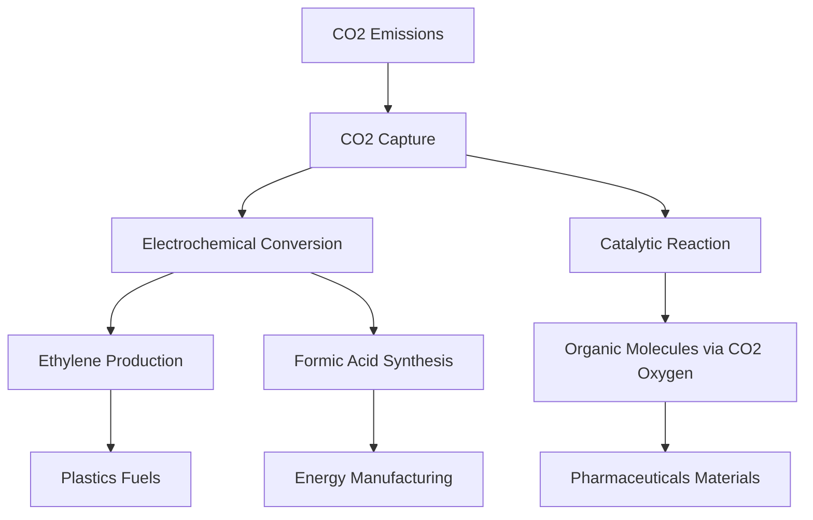

## Chemistry's Carbon Revolution: Turning Emissions into Opportunity

**July 27, 2026** – The ongoing global effort to combat climate change is finding a powerful ally in chemistry, with recent breakthroughs demonstrating innovative ways to transform problematic carbon dioxide (CO2) emissions into valuable industrial resources. Far from merely capturing CO2, scientists are now fundamentally re-imagining its chemical role.

A groundbreaking study published this month, involving researchers from Politecnico di Milano, revealed a novel approach where carbon dioxide can serve not just as a carbon source, but as an *oxygen source* in critical organic reactions. This process, which is important for producing molecules used in chemical, pharmaceutical, and materials industries, employs visible light and an iron-based catalyst at room temperature and atmospheric pressure, offering a safer and more sustainable alternative to traditional methods that often rely on hazardous reagents. This represents a significant shift in perspective, leveraging CO2's stability in an entirely new way.

This innovative use of CO2 is part of a broader trend in "carbon valorization." Scientists are also making strides in converting captured CO2 into useful chemicals and fuels. For instance, new technologies can efficiently transform CO2 into ethylene, a key chemical for plastics and packaging, using bismuth-copper alloy catalysts and renewable electricity. Such processes hold the potential to remove more CO2 from the atmosphere than they emit. Another development saw the creation of a device that captures CO2 directly from exhaust gases and converts it into formic acid, used in energy and manufacturing, in a single step, even functioning at atmospheric CO2 levels. Efforts are also underway to establish research centers dedicated to developing techniques for converting biogenic carbon dioxide into high-value products like polymers, solvents, and pharmaceutical building blocks, aiming to significantly lower the climate footprint compared to fossil-based products.

These advancements underscore a pivotal moment in chemistry, transforming CO2 from a major climate concern into a versatile raw material. By developing elegant and efficient ways to integrate CO2 into the chemical supply chain, researchers are paving the way for a truly circular and sustainable economy.

