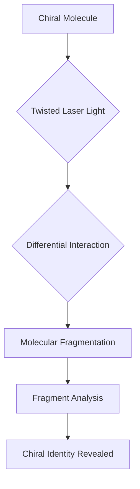

## Unraveling Molecular Handedness: Twisted Light Revolutionizes Chiral Analysis

**July 28, 2026** – In a significant leap for analytical chemistry, scientists have unveiled a novel method employing twisted laser light to rapidly and precisely differentiate between mirror-image molecules, known as enantiomers. This breakthrough, announced today, promises to streamline critical processes in pharmaceutical and chemical industries where molecular handedness can dictate efficacy and safety.

Many molecules exist in two forms that are non-superimposable mirror images of each other, much like left and right hands. Despite their near-identical appearance, these "chiral" twins can exhibit dramatically different behaviors, especially within living systems and medicines. For instance, one enantiomer of a drug might be therapeutic, while its mirror image could be ineffective or even harmful.

The new approach utilizes specially engineered twisted laser beams that interact distinctively with right-handed and left-handed molecules. When these ultrashort laser pulses strike a gaseous sample of a chiral molecule, they cause it to break into charged fragments. The unique interaction with the twisted light reveals the molecule's specific handedness through the characteristics of the fragments produced.

This innovative technique offers a faster, simpler, and more sensitive way to analyze these important molecules, which are ubiquitous in chemistry and pharmaceuticals. The ability to easily and accurately identify molecular handedness could unlock new opportunities in various scientific fields, where selecting the correct enantiomer is often paramount for desired biological or medical effects.

