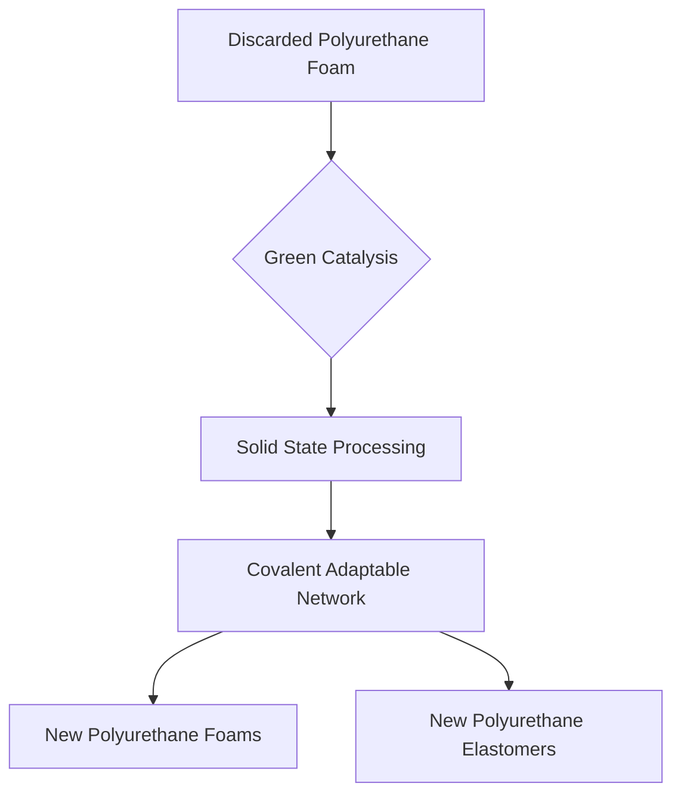

## Chemistry's Green Revolution: Upcycling Polyurethane and Engineering a Sustainable Future

**July 29, 2026** – The world of chemistry is buzzing with innovations aimed at a more sustainable future, and recent announcements from the American Chemical Society (ACS) highlight groundbreaking strides. The 2026 Green Chemistry Challenge Awards, announced in early July, recognize pivotal advancements that promise to revolutionize industries and significantly reduce environmental impact.

Among the leading innovations is a solid-state recycling platform developed by Professor William R. Dichtel of Northwestern University and Dr. Alaaeddin Alsbaiee of BASF Corporation. They have tackled the long-standing challenge of polyurethane (PU) waste, a material typically considered non-recyclable due to its cross-linked thermoset structure. Their breakthrough uses low-toxicity metal and organic catalysts to facilitate carbamate exchange within PU networks during processing. This "short-loop" process converts the waste into covalent adaptable networks, enabling the direct upcycling of post-industrial and post-consumer PU foams and elastomers into high-value new products without depolymerization or harmful solvents.

Further demonstrating the power of green chemistry, IFF was recognized for its Designed Enzymatic Biomaterials (DEB) platform. This innovative technology enables the creation of high-performance, renewable, and biodegradable polymers through precision enzyme-catalyzed polymerization under mild, scalable conditions. The DEB platform offers a sustainable alternative to fossil-based, non-biodegradable polymers, matching their performance while reducing climate impact and supporting circular end-of-life pathways. These advancements underscore a critical shift in chemical research towards designing materials with environmental responsibility at their core, moving away from traditional reliance on finite resources and addressing the growing issue of plastic pollution.

These awards showcase that chemistry is not just about new discoveries, but about reimagining existing processes and materials to build a truly sustainable future.

