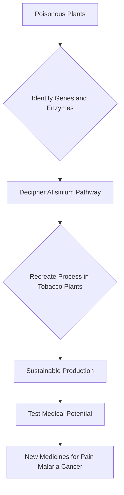

## Nature's Pharmacy Unlocked: Deadly Flowers Inspire New Medicines

**August 03, 2026** – In a fascinating breakthrough that marries botany with synthetic chemistry, scientists have announced a pivotal step towards developing powerful new medicines from famously poisonous plants. Today, researchers revealed they have deciphered how two deadly species, wolfsbane and larkspur, produce complex compounds with significant medical potential. This discovery paves the way for a sustainable pipeline of novel therapeutics for conditions ranging from pain to cancer.

For millennia, humans have observed the potent effects of plants, sometimes for healing, other times for harm. Now, scientists from Michigan State University and the Czech Academy of Sciences have delved into the genetic secrets of wolfsbane and larkspur, plants known for their nerve-damaging and paralytic properties. They successfully identified six specific enzymes essential for constructing a complex compound called atisinium. The real marvel is their ability to recreate this intricate chemical process inside tobacco plants, transforming them into miniature pharmaceutical factories.

This innovative approach addresses a critical challenge in drug discovery: accessing rare and complex natural molecules in sufficient quantities for research and development. By reproducing the chemical synthesis within a common plant like tobacco, researchers can sustainably produce and rigorously test these medically promising molecules. This opens new avenues for creating treatments for pain management, malaria, various cancers, and even agricultural pest control. The integration of advanced computational chemistry and AI is also accelerating materials discovery and drug development, allowing researchers to predict molecular behavior and optimize compounds with unprecedented speed.

The work highlights the continuing importance of natural products in drug discovery and the transformative power of chemistry to harness nature's complexity for human benefit. As we look ahead, green chemistry principles are increasingly influencing drug development, with sustainable electrochemical synthesis emerging as a key trend for reducing waste and enhancing efficiency in creating new therapeutic molecules.

