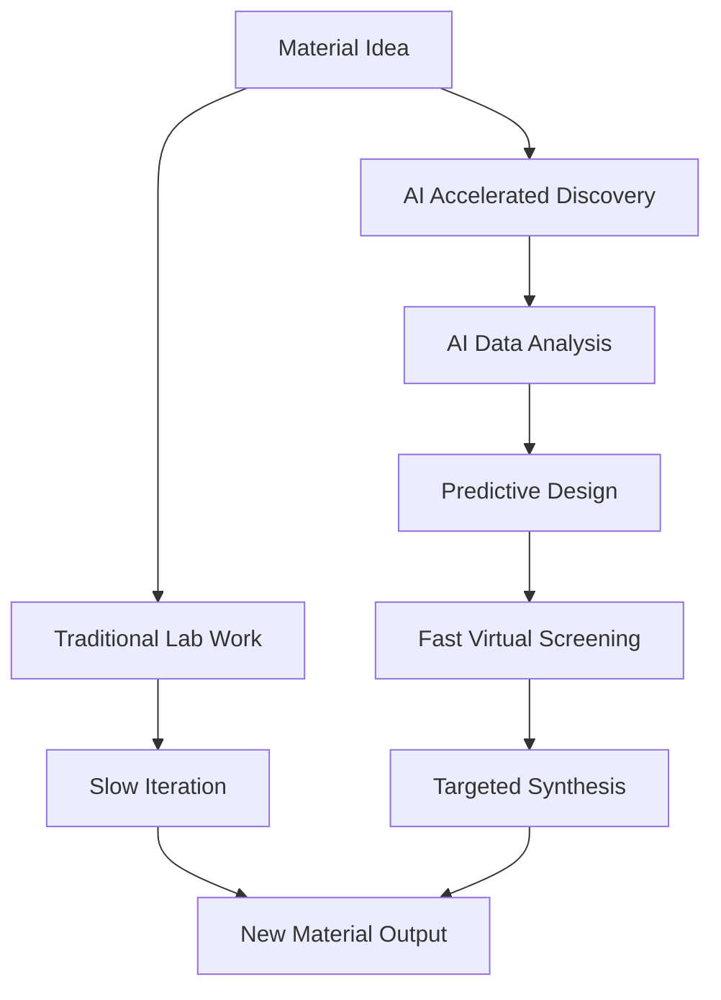

## AI Revolutionizes Chemistry: Accelerating Materials Discovery in 2026

**August 04, 2026** – The world of chemistry is experiencing a profound transformation, with Artificial Intelligence (AI) emerging as a pivotal force, particularly in the realm of materials discovery. As of August 2026, AI is no longer just a futuristic concept but a vital tool actively reshaping research and development cycles, promising unprecedented speed and efficiency.

The application of AI in materials discovery leverages sophisticated algorithms to analyze vast chemical and molecular datasets, enabling the prediction of new materials with desired properties. This groundbreaking approach significantly accelerates research by automating simulations, identifying optimal compositions, and drastically reducing the need for costly and time-consuming trial-and-error experimentation. Experts note that the AI in materials discovery market is experiencing exponential growth, reflecting its increasing adoption and impact across industries.

Major companies and research institutions are actively focusing on advancing large-scale crystal structure prediction through deep-learning-driven exploration, expanding chemical space, and enhancing computational screening workflows. This shift is driven by the urgent demand to accelerate innovation and cut development costs, with AI facilitating high-throughput virtual screening and accurate property prediction. Conferences like the 2026 GRC AI for Materials, Energy, and Chemical Sciences (AIMECS) are bringing together global innovators to explore AI's role in advancing these fields, highlighting advances in automation, robotics, and molecular discovery.

The integration of AI into materials science is enabling accurate predictions of material properties like strength, conductivity, and corrosion resistance with unprecedented precision. Generative AI models and AI-driven simulation tools are substantially reducing development time and material waste, especially in high-stakes sectors such as aerospace. This synergistic combination of AI-driven models with traditional methods allows for more directed and efficient discovery, merging AI's speed with the crucial validation provided by conventional laboratory techniques.

Below is a simplified illustration of how AI is streamlining the materials discovery process compared to traditional methods:

Beyond materials, AI's influence is also palpable in drug discovery, where new mechanisms are emerging to shorten research timelines. Sustainable chemistry is another area benefiting immensely, with AI contributing to the design of optimized materials, reduced waste through efficient computational screening, and shortened development cycles, thereby minimizing the environmental footprint of manufacturing.

As we move further into 2026, the synergy between AI and chemistry is not just a trend but a fundamental shift, promising to unlock innovations that were once considered beyond reach.