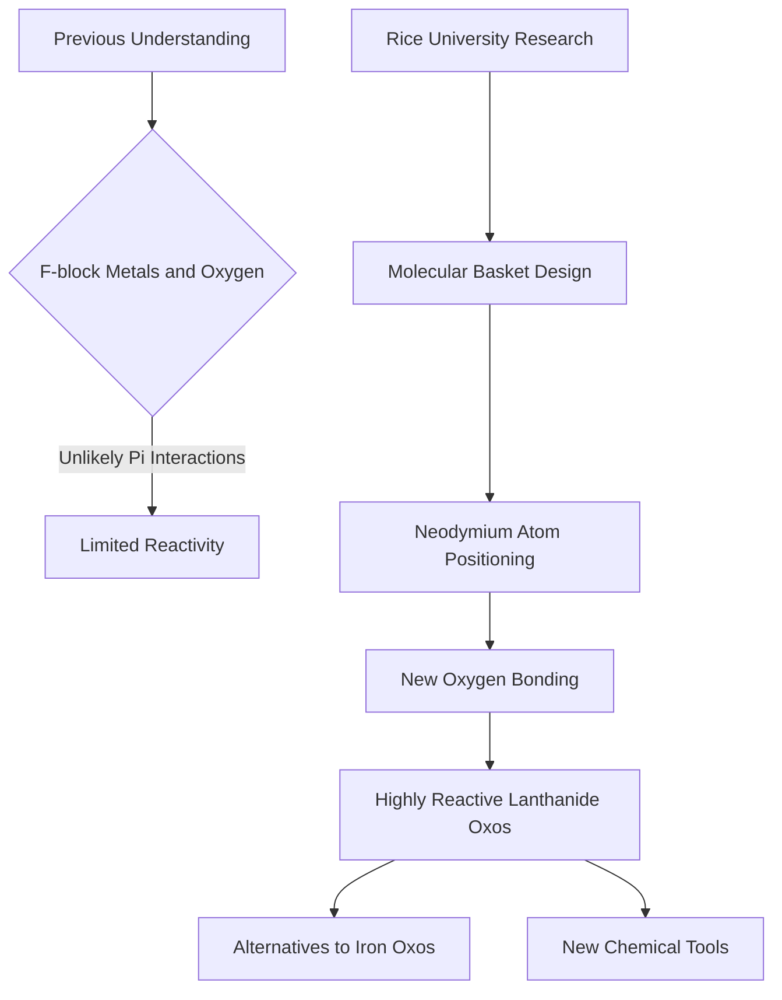

## Unlocking New Oxygen Chemistry with Rare-Earth Metals: A Recent Breakthrough

**August 05, 2026**

In a significant stride for fundamental chemistry, researchers at Rice University have reported a groundbreaking discovery, revealing a novel way for rare-earth metals to interact with oxygen. Published on July 29, 2026, this breakthrough could profoundly impact various fields, from biological studies to chemical manufacturing.

Traditionally, iron has been the star player in oxygen chemistry, notably in biological processes like hemoglobin's oxygen transport and the functions of iron oxo compounds in liver enzymes. However, the Rice team, led by chemist Raúl Hernández Sánchez, explored the potential of f-block metals, specifically lanthanides like neodymium, to form similar reactive compounds. The challenge lay in the perceived unlikelihood of these metals forming crucial pi interactions with small molecules such as oxygen.

The key to this achievement was the ingenious design of a "molecular basket." This specialized structure precisely positioned neodymium atoms, allowing them to forge a bond with oxygen that was previously thought improbable. This innovative approach led to the creation of highly reactive neodymium oxo compounds. The implications are substantial, potentially offering chemists new synthetic alternatives to iron oxos and providing fresh tools for investigating complex biological reactions and developing novel chemical manufacturing processes. This discovery opens new avenues for exploring the reactivity of a class of metals often overlooked in this specific context.

