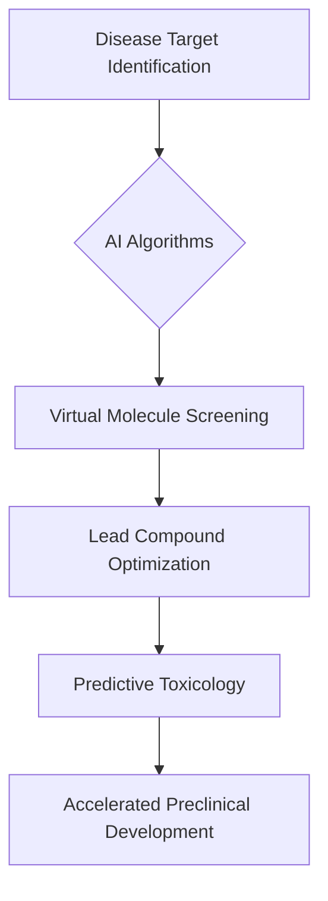

## AI Supercharges Drug Discovery: A Glimpse into Chemistry's Future

**August 8, 2026** – The landscape of chemistry is continually evolving, driven by an urgent need for innovation in areas from sustainable materials to life-saving pharmaceuticals. As of mid-2026, one of the most transformative "live" news stories in chemistry is the accelerating integration of Artificial Intelligence (AI) into drug discovery, fundamentally reshaping how new medicines are brought to patients.

Traditionally, identifying and developing new drugs has been a notoriously long, expensive, and often uncertain process, heavily reliant on trial-and-error experimentation. This often meant extensive laboratory work, screening countless compounds with limited success rates. However, recent advancements in AI and machine learning are revolutionizing every stage of this pipeline, promising a new era of efficiency and precision.

AI algorithms are now being deployed to swiftly identify potential disease targets, analyze vast biological datasets, and predict how molecules will interact with these targets. This capability extends to the *de novo* design of novel drug candidates, allowing chemists to explore chemical space more effectively and generate compounds with desired properties. Furthermore, AI excels at virtual molecule screening and predicting toxicity, significantly reducing the need for laborious and costly experimental tests in early development stages. This shift towards more predictive and integrated workflows is making discovery more disciplined and less tolerant of open-ended experimentation.

The benefits are profound: reduced research and development costs, shortened timelines from concept to clinical trials, and ultimately, a more targeted approach to developing therapies for unmet medical needs. This AI-driven paradigm is not just a trend; it's a fundamental recalibration of how the pharmaceutical industry manages risk and translates scientific breakthroughs into viable treatments.

The synergy between advanced computational power and chemical knowledge is propelling drug discovery into a new, exciting chapter, one where intelligence is embedded directly into scientific workflows, orchestrated to maximize success.

