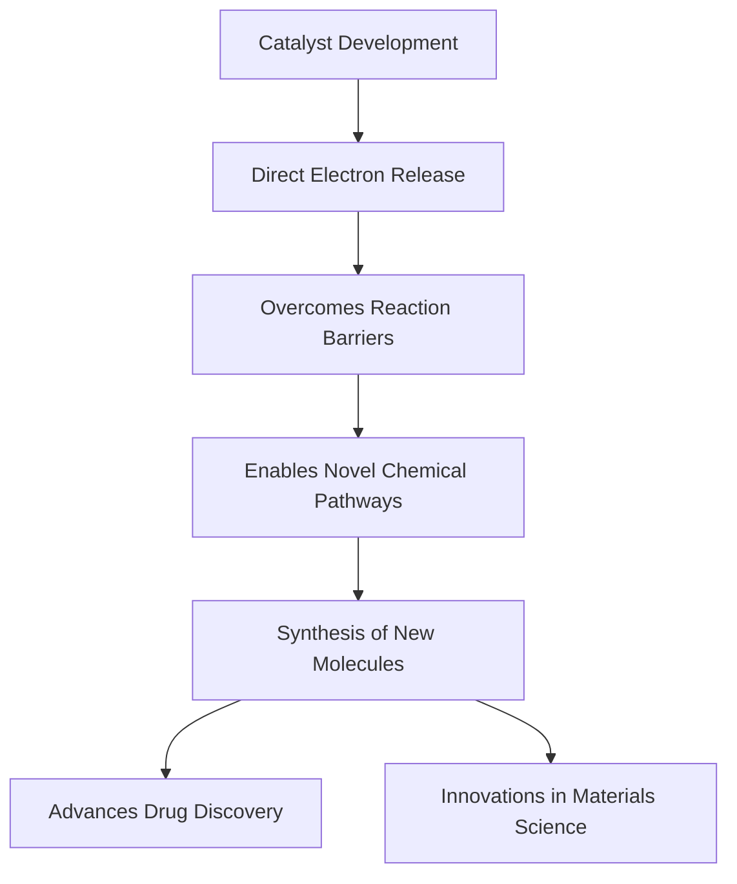

## Chemistry in Motion: Unpacking August 2026's Cutting-Edge Innovations

As of August 10, 2026, the world of chemistry is buzzing with transformative advancements, pushing the boundaries of sustainability, accelerating discovery with artificial intelligence, and unlocking novel synthetic pathways. From greener industrial processes to a revolutionary approach in catalysis, the field continues to deliver solutions to pressing global challenges.

### Green Chemistry Takes Center Stage

Sustainability remains a dominant theme, with significant strides in green chemistry. The American Chemical Society (ACS) recently announced its 2026 Green Chemistry Challenge Award winners, recognizing breakthroughs in areas like recyclable polyurethanes, sustainable pharmaceutical manufacturing, and the development of naturally inspired fungicides. These innovations are crucial for reducing hazardous substances, minimizing waste, and fostering environmental responsibility across industries. The ongoing 2026 Gordon Research Conference on Green Chemistry is further exploring scientific breakthroughs in sustainable chemistry, emphasizing catalytic transformations, chemical upcycling, and carbon valorization to enable low-carbon, circular chemical production. Companies are increasingly investing in bio-based feedstocks and waste heat recovery systems to reduce carbon footprints and improve resource efficiency.

### AI: The New Catalyst for Discovery

Artificial intelligence (AI), particularly generative and agentic AI, is rapidly reshaping the landscape of chemical discovery. From drug design to materials science, AI is accelerating the identification of compounds and optimizing complex chemical processes. Conferences like AI/ML for Early Drug Discovery 2026 highlight how computational tools and data analytics are being leveraged earlier in the drug development process to drive better clinical outcomes, streamline screening, and enhance molecular design. This technological integration promises to revolutionize how new medicines reach patients and how researchers tackle previously intractable diseases.

### A Breakthrough in Electron Transfer Chemistry

In a particularly exciting development reported on August 9, 2026, chemists have devised a novel catalyst that overcomes a long-standing barrier in electron transfer chemistry. This breakthrough allows electrons to be released directly into solution, circumventing traditional limitations that dictate which molecules receive electrons during reactions. This innovative technique opens the door to previously inaccessible reactions and the creation of potentially useful new molecules, with profound implications for drug discovery and advanced materials synthesis.

An experimental drug targeting cancer metabolism also made headlines on August 5, 2026. Researchers developed a compound that exploits cancer cells' voracious appetite for sugar while simultaneously cutting off their backup fat supply, leading to significant cancer cell death in lab and mouse models. Additionally, advances in the synthesis and structural regulation of atomically precise coinage metal nanoclusters, published on August 9, 2026, promise new pathways for nanomaterial synthesis.

Here's a look at the implications of the electron transfer breakthrough:

These recent developments underscore a vibrant and rapidly evolving field, poised to deliver innovative solutions for health, sustainability, and technological advancement in the years to come.