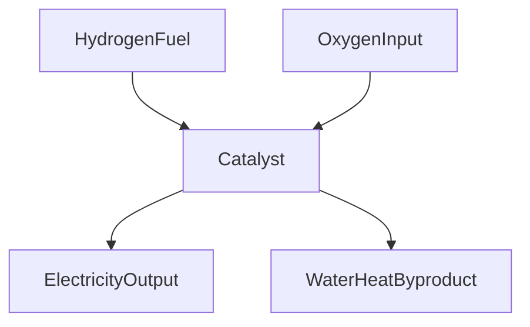

**Chemistry Today: Breakthroughs Shaping Our World (August 11, 2026)**

Today, August 11, 2026, the world of chemistry continues to buzz with innovations that are poised to reshape technology, energy, and environmental solutions. Researchers globally are pushing boundaries, delivering breakthroughs that promise a cleaner, more efficient future.

One of the most exciting recent developments comes from chemists who have shattered a decades-old barrier in chemical reactions. A newly developed catalyst allows electrons to be released directly into a solution, fundamentally altering which molecules receive electrons during chemical reactions. This groundbreaking "free-electron chemistry" technique could unlock a vast array of previously unattainable reactions and facilitate the creation of novel, useful molecules for various applications, from life-saving drugs to advanced materials. This innovative approach overcomes limitations where electrons typically favor molecules that are easier to reduce, opening new pathways for reaction design.

In the realm of sustainable energy, significant strides are being made in fuel cell technology. A new nanostructured carbon design has dramatically reduced the amount of platinum required in fuel cell catalysts while maintaining remarkable stability and efficiency. This breakthrough is crucial for making hydrogen fuel cells a more practical and cost-effective option for powering energy-intensive facilities like data centers, as well as vehicles and other technologies, by converting hydrogen and oxygen directly into electricity. By enabling data centers to generate their own electricity, this innovation could alleviate pressure on existing power grids.

Furthermore, efforts to combat pervasive environmental pollutants are also seeing progress. New methods are continually being explored and developed to break down "forever chemicals," or PFAS (per- and polyfluoroalkyl substances), which are known for their persistence in the environment and resistance to degradation. These advancements are critical for protecting water sources and ecosystems from these stubborn contaminants.

The continuous evolution of chemical science, from fundamental electron transfer mechanisms to applied energy and environmental solutions, highlights its indispensable role in addressing global challenges.

Here’s a simplified look at how hydrogen fuel cells operate:

