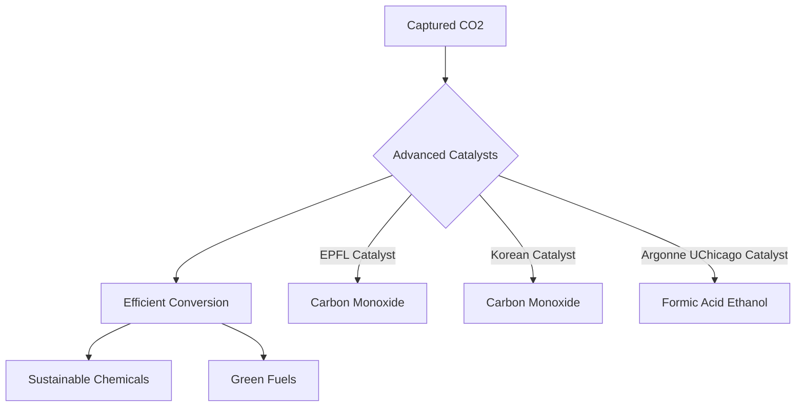

**Chemistry's Climate Frontier: Catalytic Breakthroughs Drive Carbon Utilization Forward**

August 22, 2026 – The urgent global effort to combat climate change is seeing significant momentum in the realm of chemistry, particularly with groundbreaking advancements in carbon capture and utilization (CCU). As of mid-2026, the focus is increasingly shifting from mere carbon storage to innovative ways of transforming captured CO2 into valuable industrial feedstocks and sustainable fuels, thanks to a new generation of highly efficient catalysts and integrated systems.

The latest updates from the International Energy Agency (IEA) and the UN Environment Programme (UNEP) underscore the critical role of CCUS in achieving net-zero emissions, with projects steadily advancing from demonstration to commercial scale. Operational and under-construction capture capacity for CO2 has seen notable increases, with a stronger emphasis on moving existing projects forward.

One of the most exciting developments comes from researchers who are perfecting catalysts capable of converting CO2 with unprecedented efficiency. In late 2025, scientists at EPFL unveiled a cobalt-nickel alloy catalyst encapsulated within a ceramic material, achieving 90% energy efficiency and 100% product selectivity in converting CO2 into industrial chemicals like carbon monoxide, demonstrating remarkable stability over 2,000 hours. This marks a significant leap toward large-scale carbon recycling. Similarly, Korean researchers introduced a novel copper-magnesium-iron catalyst that transforms CO2 into carbon monoxide at lower temperatures with record-breaking efficiency and stability, paving the way for more affordable carbon-neutral synthetic fuels. Furthermore, metal-free boron-oxy-carbide catalysts are emerging as a promising route for the Reverse Water Gas Shift reaction, converting CO2 into syngas without relying on traditional transition metals.

Perhaps most impactful for direct application, scientists from Argonne National Laboratory and the University of Chicago have demonstrated tin-based catalysts that efficiently convert CO2 directly from industrial exhaust gases—or even ambient air—into useful chemicals like ethanol, acetic acid, or formic acid. This innovation, announced in early 2026, integrates carbon capture and conversion into a single-step electrode system, simplifying the pathway for CO2 utilization under realistic gas conditions.

These advancements are crucial for developing "green fuels" and sustainable chemicals, contributing to a circular carbon economy. Companies are also integrating direct air capture (DAC) with CO2-to-syngas conversion to create carbon-negative jet fuels, further closing the loop on emissions.

The chemical industry is at the forefront of this revolution, transforming what was once a waste product into a valuable resource and paving a clearer path towards a sustainable future.

