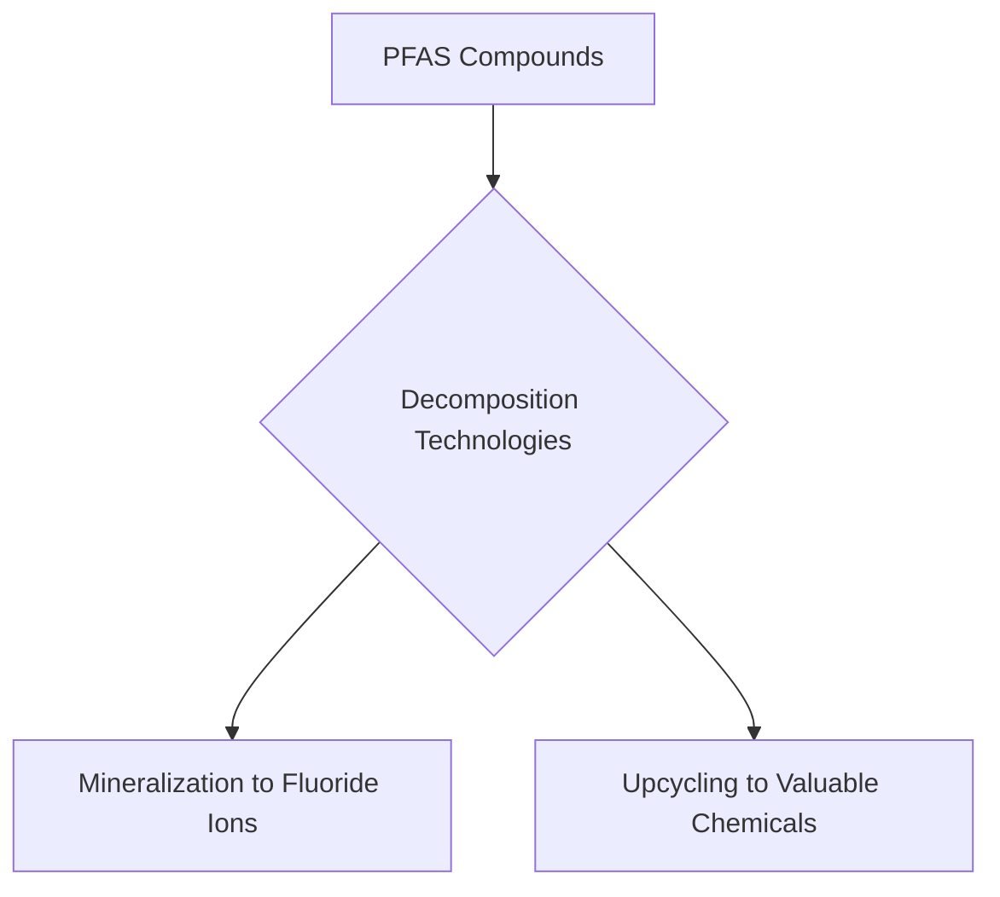

### Breaking Down the "Forever Chemicals": New Advances in PFAS Decomposition

**August 24, 2026** – The pervasive environmental challenge of per- and polyfluoroalkyl substances (PFAS), often dubbed "forever chemicals" due to their extraordinary persistence, is seeing promising new developments in their decomposition. A comprehensive review published today highlights the significant strides made in breaking down these recalcitrant compounds, offering renewed hope for environmental remediation.

PFAS are a class of synthetic chemicals found in countless consumer and industrial products, from non-stick cookware to firefighting foams. Their robust carbon-fluorine bonds make them highly stable, leading to widespread environmental contamination and concerns for human health due to their toxicity and bioaccumulative nature. The urgent need for effective destruction technologies has spurred extensive research.

The recent review focuses on advanced decomposition technologies aimed at converting both non-polymeric and polymeric PFAS into harmless fluoride ions, a process known as mineralization. Additionally, researchers are exploring innovative upcycling processes that transform these challenging substances into high-value chemicals, presenting a dual benefit of environmental cleanup and resource recovery. This progress is critical for mitigating the long-term environmental impact of PFAS and safeguarding public health.

The scientific community is actively working on diverse approaches to tackle this complex problem, reflecting a global commitment to sustainable chemistry.

Here’s a simplified look at the general pathway for PFAS decomposition:

