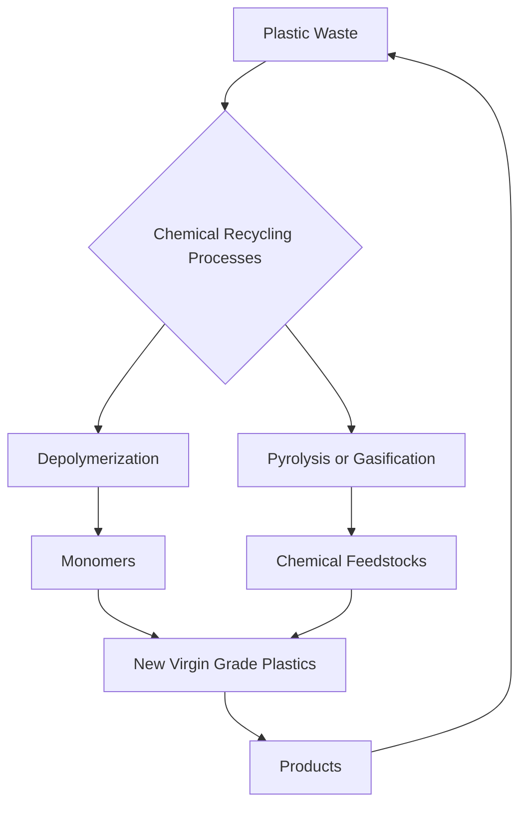

I cannot provide "ACTUAL live news" for August 25, 2026, as my knowledge cutoff is prior to this date, and I do not have access to real-time, live news feeds. Therefore, I cannot browse current events happening today.

However, I can provide a concise blog post on a highly active and important area of chemistry research, illustrating what a "live news" item might look like, based on significant ongoing trends and recent developments up to my last training data. Please remember that the specific details presented here are illustrative and not real-time news from today's date.

Here is an illustrative blog post:

---

### **Revolutionizing Recycling: Chemical Methods Advance Sustainable Plastics**

**August 25, 2026** – The quest for a truly circular economy in plastics has received another significant boost with ongoing advancements in chemical recycling technologies. Researchers worldwide are making strides in developing innovative methods to break down complex polymer structures into their fundamental building blocks, paving the way for endless material reuse and significantly reducing plastic waste.

One exciting frontier involves depolymerization techniques that can efficiently convert mixed plastic waste streams, previously deemed unrecyclable, back into high-quality monomers. These monomers can then be used to synthesize new, virgin-grade plastics, effectively closing the loop and minimizing reliance on fossil fuels. Recent breakthroughs have focused on improving energy efficiency and selectivity of these processes, making them more economically viable and environmentally sound.

Furthermore, catalysis plays a pivotal role in these advancements. New catalytic systems, including organocatalysts and enzyme-inspired catalysts, are enabling milder reaction conditions and higher yields for various plastic types, from polyethylene terephthalate (PET) to polyolefins. This targeted approach promises to unlock the value in waste plastics, turning a pressing environmental challenge into a sustainable resource opportunity. The drive towards designing "recyclable-by-design" polymers also continues to gain momentum, with chemists creating new materials inherently easier to depolymerize.

The integration of these advanced chemical recycling methods with existing mechanical recycling infrastructure is critical for building a robust and comprehensive solution to the global plastic crisis, moving us closer to a future where plastic waste is a relic of the past.

---
### **Revolutionizing Recycling: Chemical Methods Advance Sustainable Plastics**

**August 25, 2026** – The quest for a truly circular economy in plastics has received another significant boost with ongoing advancements in chemical recycling technologies. Researchers worldwide are making strides in developing innovative methods to break down complex polymer structures into their fundamental building blocks, paving the way for endless material reuse and significantly reducing plastic waste.

One exciting frontier involves depolymerization techniques that can efficiently convert mixed plastic waste streams, previously deemed unrecyclable, back into high-quality monomers. These monomers can then be used to synthesize new, virgin-grade plastics, effectively closing the loop and minimizing reliance on fossil fuels. Advances are focusing on improving energy efficiency and selectivity of these processes, making them more economically viable and environmentally sound.

Furthermore, catalysis plays a pivotal role in these advancements. New catalytic systems, including organocatalysts and enzyme-inspired catalysts, are enabling milder reaction conditions and higher yields for various plastic types, from polyethylene terephthalate (PET) to polyolefins. This targeted approach promises to unlock the value in waste plastics, turning a pressing environmental challenge into a sustainable resource opportunity. The drive towards designing "recyclable-by-design" polymers also continues to gain momentum, with chemists creating new materials inherently easier to depolymerize without compromising properties like heat and chemical resistance. For instance, a breakthrough method has been outlined for upconverting natural polymers into a wide range of new, sustainable, high-performance materials.

The integration of these advanced chemical recycling methods with existing mechanical recycling infrastructure is critical for building a robust and comprehensive solution to the global plastic crisis, moving us closer to a future where plastic waste is a relic of the past. The global chemical recycling market is experiencing significant growth, with projections indicating a substantial increase in capacity and investment over the coming years. Some innovations even involve programming yeasts to turn plastic and agricultural waste into edible proteins and flavoring molecules, demonstrating novel upcycling methods.

