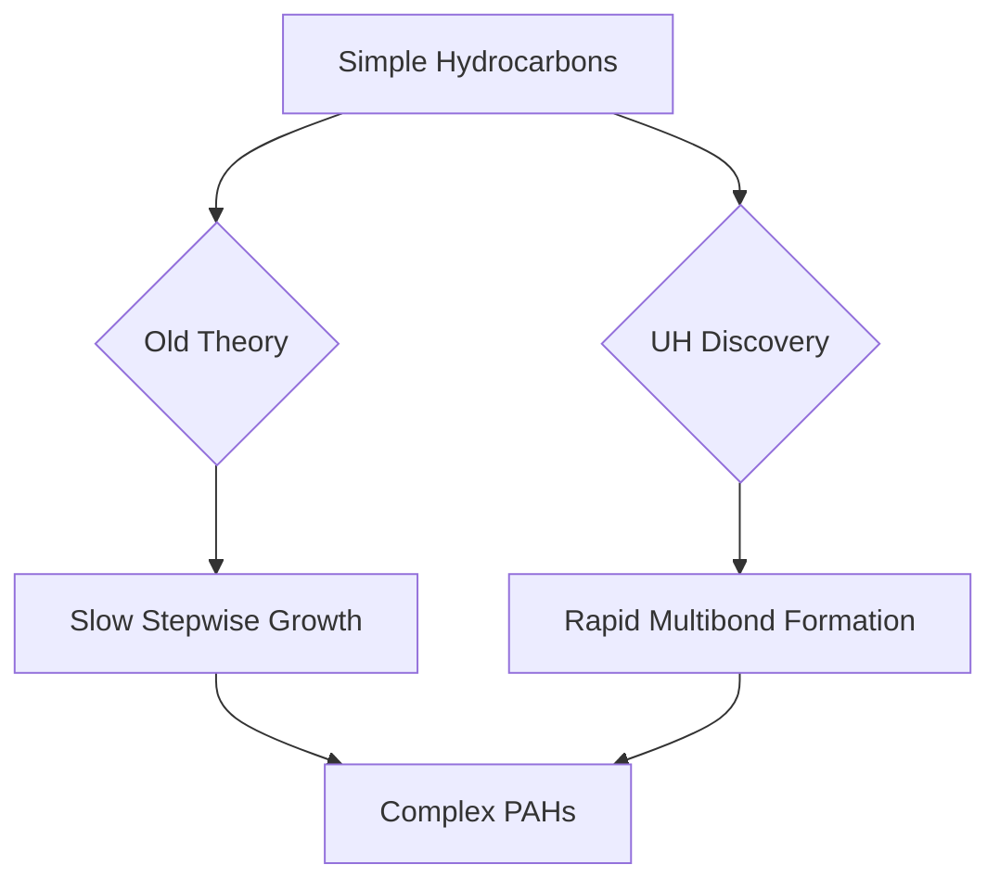

## Unlocking Cosmic Chemistry: UH Scientists Discover Faster Path to Universal Building Blocks

**Honolulu, HI – August 27, 2026** – A groundbreaking discovery by a research team at the University of Hawaiʻi at Mānoa Department of Chemistry has unveiled a significantly faster mechanism for the formation of large carbon-based molecules, known as polycyclic aromatic hydrocarbons (PAHs), in space. This finding, published today in Nature Communications, addresses a long-standing mystery regarding the rapid abundance of these crucial cosmic components.

PAHs are ubiquitous throughout the universe, found in everything from dying stars to interstellar gas clouds. Scientists have observed these complex molecules extensively, but existing theories struggled to explain how they could form quickly enough to match astronomical observations and the material returned from carbonaceous asteroids.

The UH-led team, demonstrating their findings through laboratory experiments that mimicked the extreme conditions around aging stars, identified a novel chemical process. Instead of the previously understood slow, step-by-step addition of carbon atoms, this new pathway allows for the formation of several new chemical bonds in a single, rapid step. This accelerates the growth of larger, more intricate molecules.

This breakthrough dramatically changes our understanding of carbon evolution in the cosmos and the creation of increasingly complex molecules. These molecules are believed to play a vital role in the chemistry of stars, planets, and the raw material that ultimately forms solar systems.

