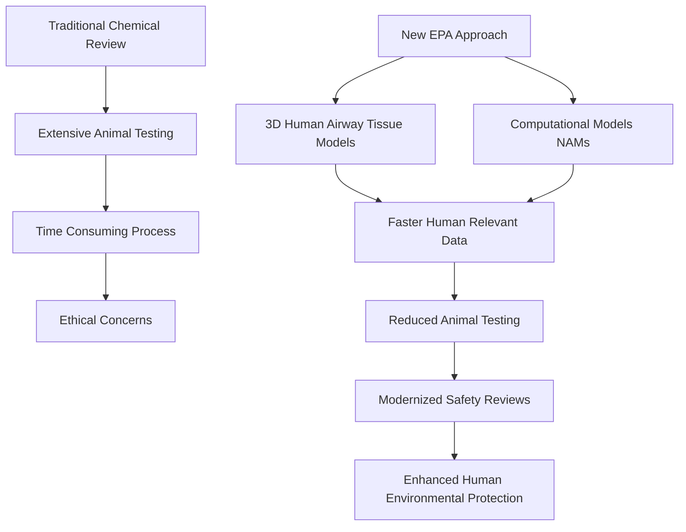

## Chemistry's Leap Forward: A Greener Path to Chemical Safety

**August 28, 2026** – In a significant move towards more ethical and efficient chemical evaluation, the U.S. Environmental Protection Agency (EPA) has announced major scientific advancements aimed at modernizing safety reviews and drastically reducing reliance on animal testing. This timely development underscores a global shift towards sophisticated, human-relevant methodologies in chemistry.

Just yesterday, on August 27, 2026, the EPA unveiled two key advancements designed to improve the assessment of new chemicals and pesticides. These innovations promise faster, more accurate results with greater human relevance, aligning with the agency's commitment to transparency and environmental protection.

At the heart of this modernization is the updated scientific framework for assessing surfactants, common chemicals found in cleaning products. Instead of traditional animal studies, the EPA will now utilize 3D human airway tissue models. This cutting-edge approach allows for a more precise prediction of how these substances might irritate human lungs. Furthermore, the agency is expanding its use of New Approach Methodologies (NAMs), which include advanced computer modeling, cell-based studies, and data-sharing platforms to estimate chemical toxicity without using live animals. These NAMs are considered functionally equivalent alternatives to mammalian testing.

This initiative marks a crucial step toward the EPA's ambitious goal of eliminating mammalian animal testing by 2035, fostering innovation and setting a new gold standard for chemical research.

Here's a look at the evolving landscape of chemical safety assessment:

