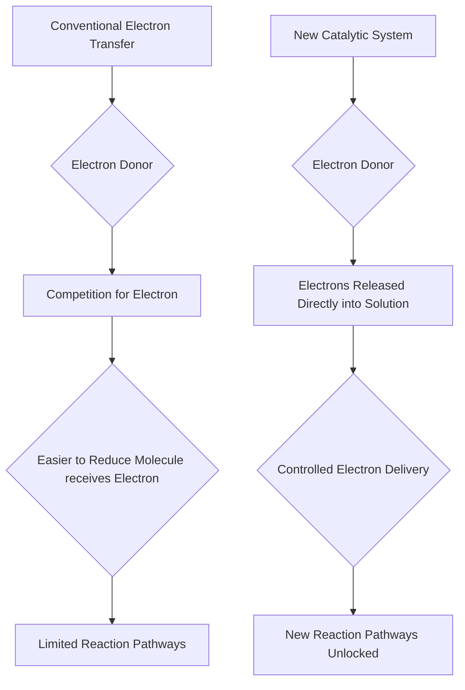

## Electron Transfer Revolution: Chemists Break Decades-Old Barrier

**August 29, 2026** – In a significant leap forward for synthetic chemistry, a team of researchers from the University of Wisconsin-Madison, in collaboration with Colorado State University and the University of Colorado Boulder, has announced a breakthrough that overcomes a long-standing limitation in electron transfer reactions. Published earlier this month, this innovation could unlock a vast array of previously unattainable molecules and reaction pathways.

For decades, chemists have relied on single-electron transfer as a powerful tool to activate molecules and facilitate complex bond formations crucial for developing life-saving drugs and advanced materials. However, a fundamental hurdle persisted: when multiple molecules competed for an electron, the electron would almost invariably go to the molecule that was easier to reduce. This inherent selectivity prevented researchers from steering reactions toward many potentially useful, yet thermodynamically less favorable, pathways.

The new approach introduces a novel catalyst that radically alters this dynamic. Instead of relying on conventional chemical preferences to dictate electron flow, the researchers found a way to release electrons directly into the solution. This direct electron delivery bypasses the traditional competition, allowing for precise control over which molecule receives the electron, regardless of its inherent reduction potential.

This "free-electron chemistry" breakthrough holds immense promise. By removing a major bottleneck, chemists can now explore and synthesize molecules that were previously considered impossible to create. This could accelerate discoveries in pharmaceuticals, materials science, and various other fields, opening new avenues for innovation and addressing complex scientific challenges.

### Understanding the Electron Transfer Shift

