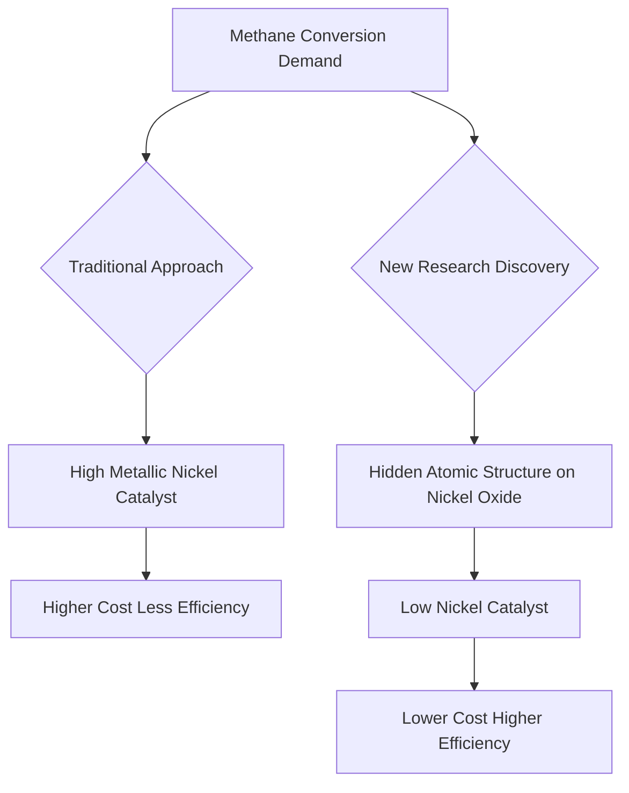

## Unlocking Methane's Potential: A Hidden Atomic Structure Revolutionizes Catalysis

**September 09, 2026** – In a significant leap for industrial chemistry, researchers from China have unveiled a previously hidden atomic structure on nickel oxide that dramatically enhances methane conversion. This breakthrough, published today, could lead to far cheaper and more efficient catalysts, reshaping processes critical to energy and chemical production.

For years, metallic nickel was considered the key driver in methane conversion reactions. However, this new research reveals that a subtle, tiny atomic structure forming on nickel oxide surfaces during the conversion process is, in fact, more effective. This discovery allowed scientists to develop a low-nickel catalyst that rivals the performance of traditional catalysts containing ten times more metal.

The implications are substantial. Methane, a potent greenhouse gas and abundant natural resource, is a crucial feedstock for various industrial chemicals. Improving its conversion efficiency and reducing catalyst costs could lead to more sustainable and economical production pathways. This fundamental understanding of catalytic mechanisms paves the way for designing next-generation catalysts with superior performance and reduced material requirements.

Here’s a simplified look at the impact:

