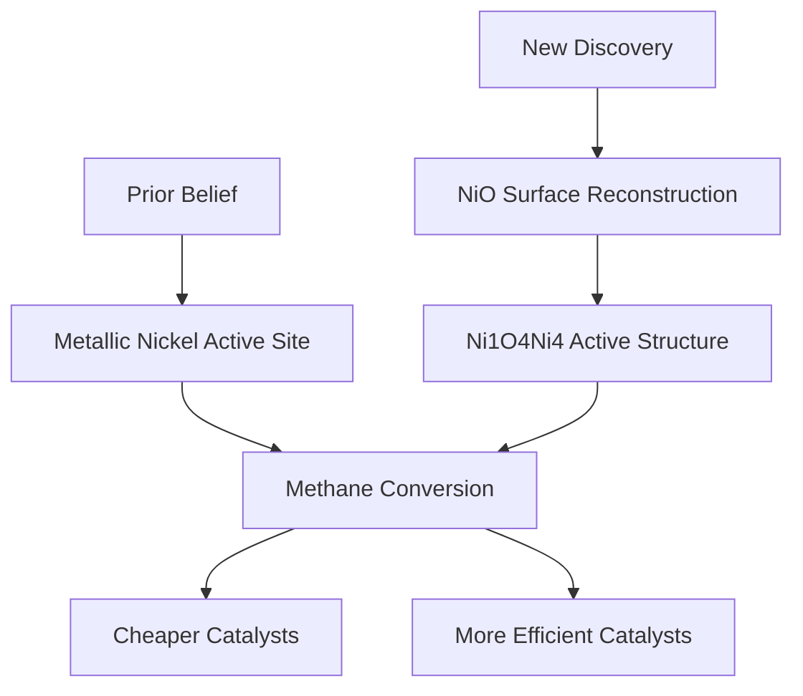

## Unlocking Methane's Potential: A Hidden Atomic Structure Revolutionizes Catalysis

**September 10, 2026** – Exciting news from the world of chemistry as scientists from the Dalian Institute of Chemical Physics, Chinese Academy of Sciences, have unveiled a groundbreaking discovery that could significantly impact industrial catalysis. Published just yesterday, their research redefines our understanding of methane conversion, a crucial process for producing syngas – a vital mixture for fuels and chemicals.

For years, the prevailing belief was that metallic nickel nanoparticles were the primary active centers driving the partial oxidation of methane (POM) reaction. However, this new study challenges that long-held assumption. Researchers found that a tiny, previously hidden atomic structure, identified as an in situ-formed Ni1O4Ni4 active structure, forms on nickel oxide during the methane conversion process. This structure, rather than metallic nickel itself, is far more effective in driving the reaction.

The implications of this discovery are substantial. By understanding the true active sites, scientists were able to develop a low-nickel catalyst that rivals the performance of catalysts containing ten times more metal. This breakthrough paves the way for the development of significantly cheaper and more efficient industrial catalysts, promising a future of more sustainable and economical chemical manufacturing. The ability to track these atomic-scale changes in real-time under realistic reaction conditions was key to this significant finding.

Here's a simplified look at the shift in understanding:

