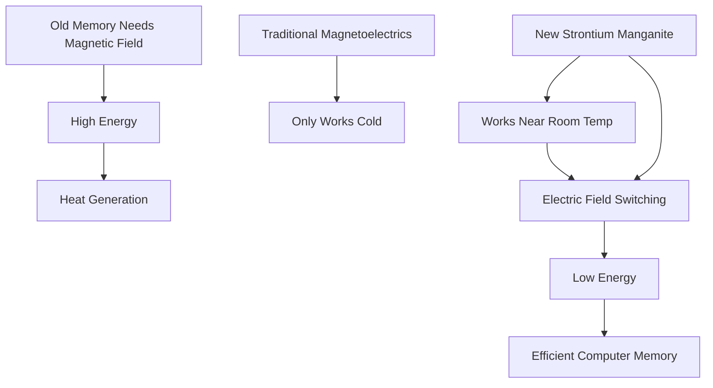

## Breakthrough in Materials Science Paves Way for Greener Computing

**September 11, 2026** – In a significant stride for materials science, researchers at the University of Warwick have unveiled a novel material that could revolutionize computer memory, making it far more energy-efficient. The discovery, a unique form of strontium manganite, exhibits both magnetism and electrical polarization at near-room temperature, a combination previously elusive for practical applications.

Current computer memory often relies on magnetic fields for data storage and switching, a process that demands considerable energy and generates heat. Materials known as magnetoelectrics offer an alternative, allowing magnetic information to be switched using an electric field instead. However, most magnetoelectric materials are only functional at extremely cold temperatures, limiting their widespread use.

The Warwick team's breakthrough addresses this critical limitation. Their strontium manganite material achieves this dual functionality at temperatures close to everyday room conditions. This is made possible by a subtle structural arrangement where pairs of atoms within its crystal lattice tilt in a coordinated manner. This tiny shift creates an electrical charge across the material while also bestowing it with a weak, yet switchable, magnetism. Crucially, the electrical charge operates independently of the magnetism, unlike in many conventional magnetoelectrics where these properties are interdependent and only manifest at cryogenic temperatures.

This development heralds a future where computer memory could be drastically more energy-efficient, directly impacting data centers and AI systems that are increasingly power-intensive. Switching magnetic states with an electric field rather than a magnetic one promises to cut down energy consumption significantly, driving forward the quest for more sustainable technology.

The findings, published in the *Journal of the American Chemical Society* on September 8, 2026, mark a pivotal moment in the development of next-generation, energy-saving electronics.