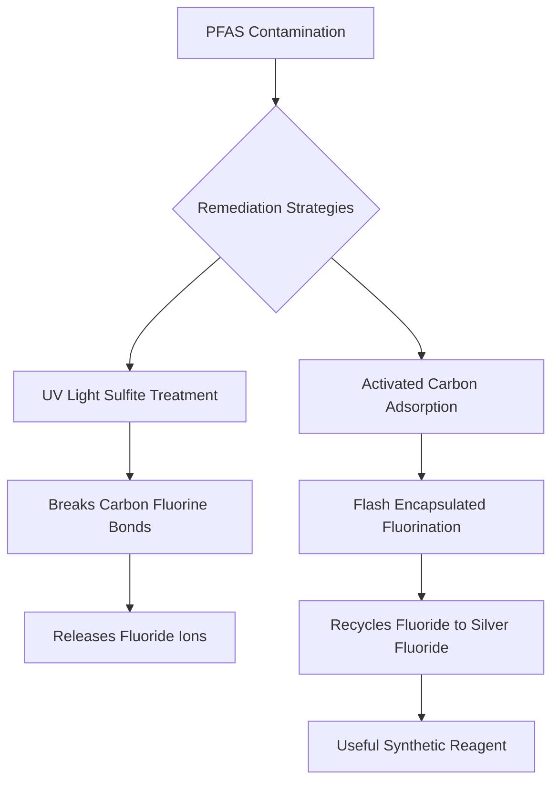

### Chemistry's Latest: A Two-Pronged Attack on "Forever Chemicals"

The fight against per- and polyfluoroalkyl substances (PFAS), commonly known as "forever chemicals," has seen significant advancements this week, offering new hope for environmental remediation and resource recovery. Recent breakthroughs from UC Riverside and Rice University are charting a more sustainable path forward.

On September 8, 2026, environmental engineers at UC Riverside unveiled key chemical reactions involved in destroying PFAS pollutants in water using ultraviolet (UV) light. Their research provides a crucial roadmap for developing more effective cleanup technologies. The process leverages UV light and sulfite to generate highly reactive electrons that attack the robust carbon-fluorine bonds in PFAS molecules, stripping away fluorine atoms and releasing them as less problematic fluoride ions. This complex sequence of reactions progressively dismantles the persistent chemicals.

Building on efforts to manage these widespread contaminants, Rice University researchers announced on September 11, 2026, a novel method to recycle fluoride from neutralized PFAS waste. Instead of merely converting it into environmentally stable waste, their "flash encapsulated fluorination" process transforms the fluoride into silver fluoride—a valuable synthetic reagent. This innovation turns a hazardous waste product into a useful compound for other manufacturing processes, creating a more circular economy approach to fluorinated materials.

These concurrent developments underscore a pivotal moment in green chemistry, moving beyond containment to active destruction and beneficial reuse of elements from these challenging pollutants.

